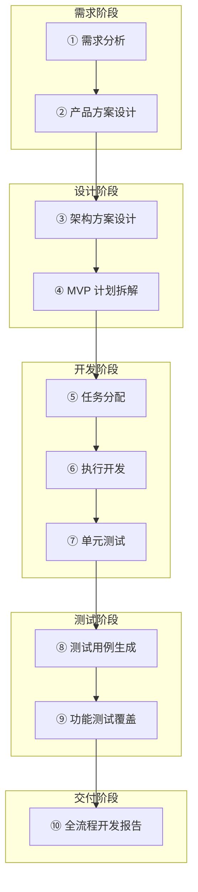
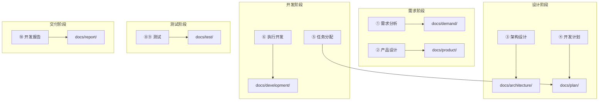
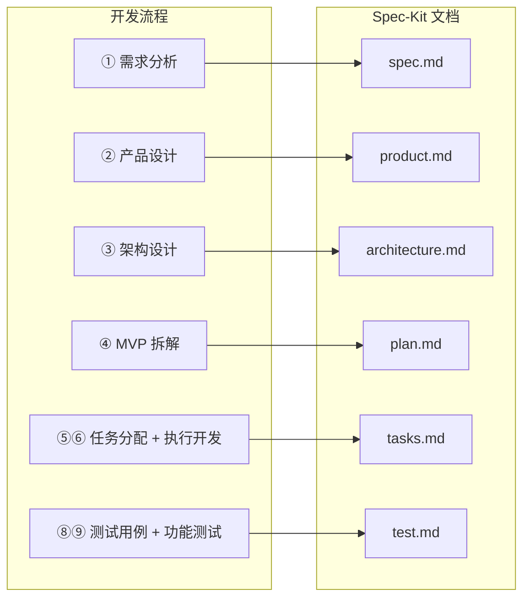

# 软件系统 Constitution

> 本文档定义了项目开发的不可变原则，所有 AI 辅助开发和人工开发必须遵循这些约束。

## 一、核心原则

### I. 测试先行 (Test-First) [NON-NEGOTIABLE]

测试驱动开发是强制性的，不可协商。

- **必须遵循 TDD 流程**:
  1. 先编写测试用例
  2. 测试用例经用户确认
  3. 确认测试失败（Red Phase）
  4. 编写实现代码使测试通过（Green Phase）
  5. 重构优化（Refactor Phase）
- **覆盖率要求**: 单元测试覆盖率 > 80%
- **API 测试**: 每个 API 接口必须有集成测试

### II. 简洁优先 (Simplicity First)

从简单开始，仅在必要时增加复杂度。

- **YAGNI 原则**: 不要实现当前不需要的功能
- **避免过度抽象**: 直接使用框架特性，不创建不必要的包装层
- **最小项目结构**: 前后端各一个项目，避免过度拆分
- **禁止预优化**: MVP 阶段不做性能优化，除非有明确的性能问题

### III. 类型安全 (Type Safety)

类型注解是强制性的。

- **Python**: 所有函数必须有完整的类型注解，使用 `mypy` 验证
- **TypeScript**: 启用严格模式，禁止使用 `any` 类型
- **数据验证**: 使用 Pydantic 进行运行时数据验证

### IV. 可观测性 (Observability)

一切操作必须可追溯。

- **操作日志**: 所有关键业务操作必须记录到 `operation_logs` 表
- **结构化日志**: 使用统一的日志格式，包含 trace_id
- **错误追踪**: 异常必须包含完整的上下文信息

### V. 模块化设计 (Modularity)

清晰的边界和职责划分。

- **服务层分离**: 每个业务领域一个 Service 类
- **API 版本控制**: 所有 API 路径以 `/api/v1/` 开头
- **依赖注入**: 使用 FastAPI Depends 进行依赖管理

### VI. DDD 架构设计 (Domain-Driven Design) [NON-NEGOTIABLE]

> ⚠️ **领域驱动设计架构 (强制执行)**
> 
> 中大型业务系统必须采用 DDD 分层架构，确保业务逻辑与技术实现解耦。

#### 四层架构

```
┌─────────────────────────────────────────────────────────────────────┐
│                        Interface Layer (接口层)                      │
│                   app/api/v1/endpoints/*.py                         │
│               Controller/Router, DTO 序列化/反序列化                  │
├─────────────────────────────────────────────────────────────────────┤
│                       Application Layer (应用层)                     │
│                        app/services/*.py                            │
│                用例编排、服务协调、事务管理、权限校验                   │
├─────────────────────────────────────────────────────────────────────┤
│                        Domain Layer (领域层)                         │
│                  app/models/*.py + app/domain/*.py                  │
│             领域模型、业务规则、聚合根、领域事件、值对象                 │
├─────────────────────────────────────────────────────────────────────┤
│                     Infrastructure Layer (基础设施层)                │
│                 app/db/ + app/utils/ + app/core/                    │
│              数据库访问、外部服务、配置管理、工具类                     │
└─────────────────────────────────────────────────────────────────────┘
```

#### 目录结构规范

```
backend/app/
├── api/v1/endpoints/        # 接口层：API 路由
│   ├── auth.py              # 认证接口
│   ├── budget.py            # 预算接口
│   └── template.py          # 模板接口
├── schemas/                  # 接口层：DTO 定义
│   ├── budget.py            # 预算 DTO
│   └── template.py          # 模板 DTO
├── services/                 # 应用层：业务服务
│   ├── budget_service.py    # 预算服务
│   ├── approval_service.py  # 审批服务
│   └── template_service.py  # 模板服务
├── models/                   # 领域层：数据模型
│   ├── budget.py            # 预算实体
│   └── user.py              # 用户实体
├── domain/                   # 领域层：业务规则 (可选)
│   ├── events/              # 领域事件
│   └── rules/               # 业务规则
├── db/                       # 基础设施层：数据库
│   ├── session.py           # 数据库会话
│   └── base.py              # 基类
├── core/                     # 基础设施层：核心配置
│   ├── config.py            # 配置管理
│   └── security.py          # 安全工具
└── utils/                    # 基础设施层：工具类
    ├── obs.py               # OBS 存储
    └── dingtalk.py          # 钉钉通知
```

#### DDD 核心原则

| 原则 | 说明 | 示例 |
|------|------|------|
| **领域模型优先** | 先设计领域模型，再实现持久化 | `Budget` 实体包含业务方法 |
| **聚合根边界** | 聚合根作为事务和一致性边界 | `Budget` 是聚合根，`BudgetVersion` 是子实体 |
| **依赖倒置** | 内层不依赖外层 | Service 不直接依赖 FastAPI |
| **领域事件** | 用事件解耦模块 | `BudgetApprovedEvent` 触发通知 |
| **贫血模型禁止** | 实体必须包含业务行为 | `budget.submit()` 而非 `budget_service.submit(budget)` |

#### 禁止事项 [FORBIDDEN]

- ❌ 禁止在 API 层直接操作数据库
- ❌ 禁止在 Service 层返回 ORM 对象（必须转为 DTO）
- ❌ 禁止跨聚合直接修改（必须通过领域事件或服务）
- ❌ 禁止业务逻辑散落在 Controller 中

### VII. 前端架构规范 [NON-NEGOTIABLE]

> ⚠️ **前端架构设计 (强制执行)**
>
> 前端开发必须遵循组件化、模块化原则，确保视图与逻辑分离。

#### 核心原则
1. **逻辑分离**: UI 组件不包含复杂业务逻辑，通过 Custom Hooks 或 Stores 抽离。
2. **状态管理**: 使用 Zustand 管理全局状态，避免 Props Drilling。
3. **API 分层**: 所有的 API 调用必须封装在 `services/` 层，禁止在组件中直接使用 `axios` 或 `fetch`。

#### 目录结构规范
```
frontend/src/
├── components/          # 公共组件 (Atomic Design)
├── pages/               # 页面组件 (路由级)
├── services/            # API 服务层 (与后端 Controller 对应)
├── stores/              # 全局状态管理 (Zustand)
├── types/               # TypeScript 类型定义
└── utils/               # 工具函数
```

#### 禁止事项 [FORBIDDEN]
- ❌ 禁止在组件内直接拼接 API URL
- ❌ 禁止使用 `any` 类型 (必须定义 Interface)
- ❌ 禁止将巨型组件（> 300行）不拆分
- ❌ 禁止在 `useEffect` 中执行复杂的副作用逻辑

---

## 二、技术栈约束 [不可变更]

### 软件栈 (Software Stack)

| 领域 | 技术选型 | 版本要求 | 说明 |
|------|----------|----------|------|
| **后端语言** | Python | 3.12+ | 强类型注解 |
| **Web 框架** | FastAPI | 0.100+ | 异步优先 |
| **ORM 框架** | SQLAlchemy | 2.0+ | 异步模式 |
| **Schema** | Pydantic | 2.0+ | 数据验证 |
| **前端框架** | React | 18.2+ | 函数式组件 |
| **构建工具** | Vite | 5.0+ | 极速构建 |
| **UI 组件** | Ant Design | 5.0+ | 企业级 UI |
| **状态管理** | Zustand | 4.0+ | 轻量级状态 |

### 云平台 (Infrastructure)

| 服务 | 规格 | 备注 |
|------|------|------|
| **容器平台** | 华为云 CCE | Kubernetes 容器引擎 |
| **数据库** | 华为云 RDS MySQL 8.0 | 开启 TDE 加密 |
| **缓存** | 华为云 DCS Redis 7.x | 分布式缓存服务 |
| **对象存储** | 华为云 OBS | 启用 SSE-KMS 服务端加密 |
| **备份** | 华为云 CBR | 每日全量 + 实时增量 |

### K8S 统一部署规约 [NON-NEGOTIABLE]

> ⚠️ **统一容器化部署架构 (强制执行)**
> 
> 所有服务必须通过 K8S 部署，配置通过 Nacos 统一管理，禁止手动部署或直接使用环境变量传递敏感配置。

#### 架构概述

```
┌─────────────────────────────────────────────────────────────────────┐
│                    多阶段构建：前后端一体化打包                        │
├─────────────────────────────────────────────────────────────────────┤
│  Stage 1: 前端构建                                                   │
│  ┌─────────────────┐                                                │
│  │ Node.js 20.x    │ npm run build ──→ /frontend/dist               │
│  └─────────────────┘                                                │
│           │                                                          │
│           ▼                                                          │
│  Stage 2: 后端打包（包含前端产物）                                    │
│  ┌─────────────────┐                                                │
│  │ Python 3.13     │ COPY --from=frontend-builder ──→ /app/static   │
│  │ FastAPI         │ StaticFiles 挂载 ──→ 提供前端页面               │
│  └─────────────────┘                                                │
└─────────────────────────────────────────────────────────────────────┘
           │
           ▼
Harbor 镜像仓库 ──→ K8S (CCE) ──→ Pod ──→ Nacos 获取配置
       │                │                      │
       └── CI/CD 推送   └── Helm 部署          └── 运行时配置
```

#### 前后端一体化部署 [MANDATORY]

> ⚠️ **前后端必须打包为单一镜像部署，禁止分离部署**

| 约束项 | 规范 | 说明 |
|--------|------|------|
| **构建方式** | 多阶段 Docker 构建 | Stage1: 前端 npm build → Stage2: 复制到后端 |
| **静态文件位置** | `/app/static` | 前端构建产物挂载路径 |
| **静态资源挂载** | FastAPI StaticFiles | `/assets` 路由挂载静态资源 |
| **SPA 路由回退** | `/{path:path}` 返回 `index.html` | 支持前端客户端路由 |
| **API 路径前缀** | `/api/v1/*` | 后端 API 统一前缀，与前端路由区分 |

**Dockerfile 多阶段构建要求**:
```dockerfile
# Stage 1: 前端构建
FROM node:20-alpine AS frontend-builder
COPY frontend/ ./
RUN npm run build

# Stage 2: 后端 + 前端产物
FROM python:3.13-slim
COPY --from=frontend-builder /frontend/dist ./static   # ✅ 强制要求
```

**FastAPI 静态文件挂载要求** (`main.py`):
```python
# 挂载前端静态文件
static_dir = Path("/app/static")
if static_dir.exists():
    app.mount("/assets", StaticFiles(directory=static_dir / "assets"))
    
    @app.get("/{full_path:path}")
    async def serve_spa(full_path: str):
        return FileResponse(static_dir / "index.html")  # SPA 回退
```

#### 命名规范

| 资源类型 | 命名格式 | 示例 |
|----------|----------|------|
| **Namespace** | `{项目名}` | `financial-budget` |
| **Deployment** | `{项目名}-{服务}` | `financial-budget-api` |
| **Service** | `{项目名}-{服务}-svc` | `financial-budget-api-svc` |
| **ConfigMap** | `{项目名}-config` | `financial-budget-config` |
| **Secret** | `{项目名}-{用途}-secret` | `financial-budget-db-secret` |

#### 配置管理规范

| 类型 | 管理方式 | 说明 |
|------|----------|------|
| **应用配置** | Nacos | 数据库连接、SSO、OBS 等 |
| **环境变量** | Helm Values | NACOS_HOST、ENVIRONMENT 等 |
| **敏感配置** | Nacos 加密配置 | 禁止使用 K8S Secret 存储密码 |

**Nacos 连接配置 (Helm Values)**:
```yaml
env:
  NACOS_HOST: "skyline-nacos-03.skyline-middleware.svc.cluster.local"
  NACOS_PORT: "8848"
  NACOS_NAMESPACE: "skyline-ai"
  NACOS_DATA_ID: "skyline-ai-financial-budget.yaml"
  NACOS_GROUP: "DEFAULT_GROUP"
```

#### 部署目录结构 [NON-NEGOTIABLE]

> ⚠️ **必须严格按照以下目录结构存放部署文件，禁止自由发挥**

**部署文件存放位置**:
```
document/deploy/api/
├── docker/
│   ├── Dockerfile           # 镜像构建文件
│   └── start.sh             # 容器启动脚本
└── k8s/
    ├── dev-values.yaml      # 开发环境配置
    └── prod-values.yaml     # 生产环境配置
```

**文件清单**:

| 文件 | 路径 | 说明 |
|------|------|------|
| Dockerfile | `document/deploy/api/docker/Dockerfile` | 镜像构建文件 |
| start.sh | `document/deploy/api/docker/start.sh` | 容器启动脚本 |
| dev-values.yaml | `document/deploy/api/k8s/dev-values.yaml` | 开发环境 K8S 配置 |
| prod-values.yaml | `document/deploy/api/k8s/prod-values.yaml` | 生产环境 K8S 配置 |

#### 健康检查规范

| 检查类型 | 端点 | 超时 | 间隔 |
|----------|------|------|------|
| **Liveness** | `/ping` 或 `/api/v1/health` | 5s | 20s |
| **Readiness** | `/ping` 或 `/api/v1/health` | 3s | 10s |

#### 资源配额规范

| 环境 | CPU Request | CPU Limit | Memory Request | Memory Limit |
|------|-------------|-----------|----------------|--------------|
| **开发** | 200m | 1000m | 512Mi | 1.5Gi |
| **生产** | 100m | 3000m | 256Mi | 5Gi |

#### 禁止事项 [FORBIDDEN]

- ❌ 禁止前后端分离部署（必须打包为单一镜像）
- ❌ 禁止使用 Nginx 等反向代理单独托管前端静态文件
- ❌ 禁止直接 `kubectl apply` 手动部署
- ❌ 禁止在 Helm Values 中硬编码数据库密码等敏感信息
- ❌ 禁止使用 K8S Secret 存储应用级敏感配置（必须使用 Nacos）
- ❌ 禁止跳过健康检查配置
- ❌ 禁止部署时不设置资源 limits
- ❌ 禁止使用 `latest` 以外的未经 CI/CD 验证的镜像标签

#### 项目初始化模板 [MANDATORY]

> ✅ **新项目初始化时，必须直接复制本项目的部署配置文件，仅修改项目名称等必要参数**

**强制复制的配置文件清单**:

| 源文件 | 目标位置 | 需修改项 |
|--------|----------|----------|
| `document/deploy/api/docker/Dockerfile` | 原样复制 | 无需修改（通用多阶段构建） |
| `document/deploy/api/docker/start.sh` | 原样复制 | 无需修改（通用启动脚本） |
| `document/deploy/api/k8s/dev-values.yaml` | 原样复制 | 仅修改 `image.repository`、`NACOS_DATA_ID` |
| `document/deploy/api/k8s/prod-values.yaml` | 原样复制 | 仅修改 `image.repository`、`NACOS_DATA_ID`、`nodeSelector` |

**初始化命令**:
```bash
# 新项目初始化时执行
cp -r {模板项目}/document/deploy ./document/deploy

# 仅需修改以下配置项：
# 1. image.repository: harbor.skyline.com/skyline-ai/{新项目名}
# 2. NACOS_DATA_ID: skyline-ai-{新项目名}.yaml
# 3. nodeSelector (生产环境): 根据实际节点调整
```

**禁止行为**:
- ❌ 禁止从零编写 Dockerfile 和 Helm Values
- ❌ 禁止修改已验证的构建流程（多阶段构建、uv 安装等）
- ❌ 禁止删除健康检查、资源限制等必要配置

#### 相关文件（可直接复制）

- [Dockerfile](../../document/deploy/api/docker/Dockerfile) - 通用多阶段构建模板
- [start.sh](../../document/deploy/api/docker/start.sh) - 通用启动脚本
- [开发环境 Values](../../document/deploy/api/k8s/dev-values.yaml) - 开发环境配置模板
- [生产环境 Values](../../document/deploy/api/k8s/prod-values.yaml) - 生产环境配置模板

### 前端技术栈

| 技术 | 版本 | 必须/可选 |
|------|------|----------|
| React | 18.x | 必须 |
| TypeScript | 5.x | 必须 |
| Vite | 5.x | 必须 |
| Ant Design | 5.x | 必须 |
| React Router | 6.x | 必须 |
| Zustand | 4.x | 必须 |
| Axios | 1.x | 必须 |

**禁止使用**: jQuery、Vue、Angular、其他 UI 库

### 后端技术栈

| 技术 | 版本 | 必须/可选 |
|------|------|----------|
| Python | 3.11+ | 必须 |
| FastAPI | 0.100+ | 必须 |
| SQLAlchemy | 2.x | 必须 |
| Pydantic | 2.x | 必须 |
| Alembic | 1.x | 必须 |
| uvicorn | 0.20+ | 必须 |

**禁止使用**: Flask、Django、Tornado

### 认证方案 [NON-NEGOTIABLE]

> ⚠️ **单层 SSO 鉴权架构 (2026-01-07 起强制执行)**
> 
> 本项目采用**单层 SSO 鉴权**，所有认证由 SSO 网关统一处理，**禁止使用 JWT**。

#### 架构概述

```
浏览器/钉钉 ──→ SSO 网关 (MaxKey) ──→ satoken Cookie ──→ 本项目后端
                    │
                    └── 统一处理浏览器扫码 & 钉钉免登
```

#### 强制约束

| 约束项 | 规范 | 说明 |
|--------|------|------|
| **认证方式** | satoken Cookie | SSO 网关统一下发，后端验证 |
| **用户关联** | `job_number` (工号) | SSO 返回 `employeeNumber` 匹配本地用户 |
| **会话管理** | SSO 网关管理 | 本项目不维护独立会话 |
| **登出方式** | 跳转 `/token/logout` | 由 SSO 网关清除会话 |

#### 技术实现规范

**后端 (Python/FastAPI)**:
- 必须使用 `app/api/deps_sso.py` 中的 `CurrentUser` / `CurrentUserId` 依赖
- 支持 Header (`X-SSO-Employee-Number`) + Cookie (`satoken`) 双模式
- 必须提供 `/token/logout` 路由，重定向到 SSO 网关登出
- 401 响应时前端统一跳转 SSO 登出

**前端 (React/TypeScript)**:
- 401 错误统一跳转 `window.location.replace('/token/logout')`
- 禁止在 localStorage 存储 token
- 登出流程：设置登出标记 → 清除本地状态 → 跳转 `/token/logout`

#### 禁止事项 [FORBIDDEN]

- ❌ 禁止使用 JWT Token 进行认证
- ❌ 禁止在 localStorage/sessionStorage 存储认证凭证
- ❌ 禁止绕过 SSO 网关直接认证
- ❌ 禁止在代码中硬编码 satoken 或用户凭证

#### 代码脚手架 [MANDATORY]

> ✅ **新项目必须使用脚手架初始化 SSO 相关代码**

| 脚手架文件 | 说明 |
|------------|------|
| `scaffold/backend/app/api/deps_sso.py` | SSO 单层鉴权依赖 |
| `scaffold/backend/app/api/root_router.py` | `/token/logout` 路由 |
| `scaffold/backend/app/core/config.py` | 配置管理（含 SSO 配置） |
| `scaffold/backend/app/core/nacos.py` | Nacos 配置客户端 |
| `scaffold/frontend/src/services/api.ts` | Axios + SSO 拦截器 |
| `scaffold/frontend/src/contexts/AuthContext.tsx` | 认证上下文 |

**初始化命令**:
```bash
cd /path/to/new-project
.specify/scripts/init-project.sh skyline-ai-{项目名}
```

#### 相关文档

- [脚手架说明](../scaffold/README.md) - 代码脚手架使用说明
- [单层SSO鉴权改造进度表](../../docs/单层SSO鉴权改造进度表.md)
- [SSO免登实现流程](../../docs/SSO免登实现流程.md)


---

## 三、代码风格规范 [NON-NEGOTIABLE]

> ⚠️ **强制执行标准**
>
> 本项目代码风格与规范**严格遵循**公司已发布的 [架构规范.md](../../docs/architecture/架构规范.md)。
> 所有新增代码必须通过相应的 Linter 检查，并符合文档中的命名与设计约定。

### 3.1 核心规范速查

| 维度 | 规范概要 | 详细定义 |
|------|----------|----------|
| **Python** | Black 格式化, Google Docstring | [架构规范 3.1](../../docs/architecture/架构规范.md#31-python-代码规范) |
| **TypeScript** | Prettier, ESLint Strict | [架构规范 3.2](../../docs/architecture/架构规范.md#32-typescript-代码规范) |
| **API 设计** | RESTful V1, 统一响应结构 | [架构规范 5.0](../../docs/architecture/架构规范.md#五api-设计规范) |
| **Commit** | Angular 规范 (feat, fix, docs...) | [架构规范 4.1](../../docs/architecture/架构规范.md#41-commit-message-格式) |

### 3.2 常见违规示例 [FORBIDDEN]

- ❌ **变量命名**: Python 使用 camelCase (`userName`)，TS 使用 snake_case (`user_name`)
- ❌ **API 路径**: 使用动词 (`/getUsers`) 而非名词 (`/users`)
- ❌ **注释**: 缺少 Docstring 或类型注解
- ❌ **提交信息**: "修改 bug", "更新" 等无意义描述

### 3.3 自动化验证 [MANDATORY]

> 提交代码前，**必须**运行以下命令，确保 0 报错：

**后端 (Backend)**:
```bash
cd backend
make lint    # 运行 black, isort, mypy 检查
make format  # 自动修复格式问题
```

**前端 (Frontend)**:
```bash
cd frontend
npm run lint # 运行 eslint 检查
```

### Git 规范

**分支策略**:
- `main`: 生产分支，只接受 PR 合并
- `develop`: 开发分支
- `feature/*`: 功能分支
- `hotfix/*`: 热修复分支

**Commit 格式**:
```
<type>(<scope>): <subject>

type: feat | fix | docs | style | refactor | test | chore
scope: 可选，模块名称
subject: 简短描述，不超过 50 字符
```

---

## 四、安全合规原则

### 财务数据安全 [NON-NEGOTIABLE]

- **存储加密**: 所有文件必须使用 OBS SSE-KMS 加密存储
- **传输加密**: 全链路 HTTPS，禁止 HTTP
- **敏感数据**: 禁止在日志中打印敏感信息（金额、用户信息等）
- **文件水印**: 导出文件必须包含水印（导出人、时间）

### 数据保留

- **预算数据**: 永久保留（符合会计档案 5 年+ 要求）
- **操作日志**: 保留 3 年
- **文件版本**: 保留所有版本

### 访问控制

- **角色权限**: 严格基于角色的权限控制（ADMIN/USER）
- **数据权限**: 普通用户只能查看本部门数据
- **会话安全**: 登录失败 5 次锁定 30 分钟，会话 8 小时超时

---

## 五、开发流程规约 [NON-NEGOTIABLE]

> ⚠️ **10 步端到端开发流程 (强制执行)**
> 
> 所有项目开发必须遵循完整的开发流程，确保从需求到交付的全链路可追溯。

### 开发流程总览



### 10 步开发流程详解

| 步骤 | 阶段 | 产出物 | 归档目录 | 说明 |
|------|------|--------|----------|------|
| ① | 需求 | `{功能}-需求规格.md` | `docs/demand/` | 用户痛点、业务目标 |
| ② | 需求 | `{功能}-产品设计-V{版本}.md` | `docs/product/` | 功能设计、用户流程、原型 |
| ③ | 设计 | `{功能}-架构设计-V{版本}.md` | `docs/architecture/` | 技术选型、数据库、API 设计 |
| ④ | 设计 | `{功能}-开发计划.md` | `docs/plan/` | MVP 拆解、里程碑、工时 |
| ⑤ | 开发 | `{功能}-任务清单.md` | `docs/plan/` | 任务拆分、责任人、排期 |
| ⑥ | 开发 | 代码实现 | `backend/` `frontend/` | TDD 流程编写代码 |
| ⑦ | 测试 | 单元测试代码 | `tests/` | 覆盖率 > 80% |
| ⑧ | 测试 | `{功能}-测试用例.md` | `docs/test/` | 验收场景、测试步骤 |
| ⑨ | 测试 | `{功能}-测试报告.md` | `docs/test/` | 测试执行、缺陷跟踪 |
| ⑩ | 交付 | `{功能}-开发报告.md` | `docs/report/` | 全流程总结、经验沉淀 |

### 目录与开发阶段映射 [NON-NEGOTIABLE]

> ⚠️ **文档必须归档到对应阶段的目录**



| 目录 | 对应阶段 | 存放内容 |
|------|----------|----------|
| `docs/demand/` | ① 需求分析 | 需求规格、需求确认项、迭代需求 |
| `docs/product/` | ② 产品设计 | 产品设计方案、PRD、原型说明 |
| `docs/architecture/` | ③ 架构设计 | 架构设计、技术选型、API 设计 |
| `docs/plan/` | ④⑤ 计划分配 | 开发计划、任务清单、进度跟踪 |
| `docs/development/` | ⑥ 执行开发 | 开发日志、技术方案、实现说明 |
| `docs/test/` | ⑧⑨ 测试 | 测试用例、测试报告、Bug 报告 |
| `docs/report/` | ⑩ 交付 | 开发报告、迭代总结、经验沉淀 |

### 与 Spec-Kit 的映射



| Spec-Kit 文档 | 对应开发步骤 | 说明 |
|---------------|--------------|------|
| `constitution.md` | 贯穿全流程 | 不可变规约 |
| `spec.md` | ① 需求分析 | 需求规格、用户故事 |
| `product.md` | ② 产品设计 | 产品详细 PRD 设计方案 |
| `architecture.md` | ③ 架构设计 | 架构设计方案 |
| `plan.md` | ④ MVP 拆解 | 技术方案、开发计划 |
| `tasks.md` | ⑤⑥ 任务分配 + 执行开发 | 可执行任务清单 |
| `test.md` | ⑧⑨ 测试用例 + 功能测试 | 功能测试用例与方案 |


### 代码审查检查清单

在 PR 合并前必须验证：

- [ ] 符合本 Constitution 所有原则
- [ ] 符合 DDD 分层架构规范
- [ ] 有完整的单元测试覆盖 (> 80%)
- [ ] 类型注解完整 (Python mypy / TS strict)
- [ ] 无 linter 警告
- [ ] API 文档已更新 (OpenAPI)
- [ ] 相关文档已同步更新

### 文档命名规范 [NON-NEGOTIABLE]

> ⚠️ **统一的文档命名规范 (强制执行)**
>
> 所有文档必须遵循标准化命名规则，确保可追溯性和一致性。

#### 迭代目录命名

| 格式 | 示例 | 说明 |
|------|------|------|
| `YYYY-MM-DD-{迭代名称}` | `2026-01-14-用户管理功能` | 标准迭代目录 |
| `YYYY-MM-{迭代名称}` | `2026-01-预算审批优化` | 月度迭代目录 |

**正确示例**:
```
docs/demand/
├── 2026-01-14-用户管理功能/
├── 2026-01-20-预算审批优化/
└── 2026-02-01-报表导出功能/
```

**错误示例**:
```
❌ 2026-01-05迭代/         # 缺少功能名称
❌ 迭代1/                   # 无日期
❌ 新功能/                  # 无日期无编号
```

#### 文档文件命名

| 文档类型 | 命名格式 | 示例 |
|----------|----------|------|
| **需求文档** | `{功能名称}-需求规格.md` | `用户管理-需求规格.md` |
| **产品设计** | `{功能名称}-产品设计-V{版本}.md` | `预算审批-产品设计-V1.0.md` |
| **架构设计** | `{功能名称}-架构设计-V{版本}.md` | `报表导出-架构设计-V1.0.md` |
| **开发计划** | `{功能名称}-开发计划.md` | `用户管理-开发计划.md` |
| **任务清单** | `{功能名称}-任务清单.md` | `预算审批-任务清单.md` |
| **进度跟踪** | `{功能名称}-进度跟踪表.md` | `报表导出-进度跟踪表.md` |
| **测试用例** | `{功能名称}-测试用例.md` | `用户管理-测试用例.md` |
| **评审意见** | `{功能名称}-评审意见-{评审人}.md` | `产品设计-评审意见-张三.md` |
| **开发报告** | `{功能名称}-开发报告.md` | `用户管理-开发报告.md` |

#### 版本号规则

| 版本类型 | 格式 | 适用场景 |
|----------|------|----------|
| **主版本** | `V1.0`, `V2.0` | 重大变更、架构调整 |
| **次版本** | `V1.1`, `V1.2` | 功能新增、优化 |
| **修订版** | `V1.0.1` | 小修改、文字修订 |

#### 功能编号规则

用于 `.specify/specs/` 目录下的功能规格：

| 格式 | 示例 | 说明 |
|------|------|------|
| `{序号}-{功能名}` | `001-user-management` | 3 位序号 + 小写连字符 |
| `{序号}-{功能名}` | `002-budget-approval` | 按创建顺序递增 |

#### 禁止的命名方式 [FORBIDDEN]

- ❌ `产品设计方案.md` - 无功能前缀
- ❌ `架构设计方案-V2.0.md` - 无功能前缀
- ❌ `DEV-A-进度跟踪表.md` - 非标准前缀
- ❌ `UI_Renovation_Plan.md` - 英文下划线格式
- ❌ `开发任务分配方案.md` - 无功能前缀
- ❌ `2026-01-05迭代/` - 无功能名称后缀

#### 完整目录结构示例

```
docs/
├── demand/                              # ① 需求文档
│   ├── 2026-01-14-用户管理/
│   │   ├── 用户管理-需求规格.md
│   │   └── 用户管理-需求确认项.md
│   └── 2026-01-20-预算审批/
│       └── 预算审批-需求规格.md
├── product/                             # ② 产品设计
│   ├── 用户管理-产品设计-V1.0.md
│   ├── 预算审批-产品设计-V1.0.md
│   └── 预算审批-评审意见-财务专家.md
├── architecture/                        # ③ 架构设计
│   ├── 用户管理-架构设计-V1.0.md
│   ├── 预算审批-架构设计-V1.0.md
│   └── 架构规范.md
├── plan/                                # ④⑤ 计划文档
│   ├── 用户管理-开发计划.md
│   ├── 用户管理-任务清单.md
│   ├── 用户管理-进度跟踪表.md
│   └── 预算审批-开发计划.md
├── development/                         # ⑥ 开发文档
│   ├── 用户管理-技术方案.md
│   └── 用户管理-开发日志.md
├── test/                                # ⑧⑨ 测试文档
│   ├── 用户管理-测试用例.md
│   ├── 用户管理-测试报告.md
│   └── bug_report.md
└── report/                              # ⑩ 交付报告
    ├── 用户管理-开发报告.md
    └── 预算审批-开发报告.md
```

---

### 禁止事项 [FORBIDDEN]

- ❌ 禁止跳过需求分析直接开发
- ❌ 禁止无设计文档直接编码
- ❌ 禁止无测试覆盖直接合并
- ❌ 禁止无代码审查直接发布
- ❌ 禁止使用非标准文档命名
- ❌ 禁止将文档归档到错误目录

---

## 六、变更管理与文档同步 [NON-NEGOTIABLE]

> ⚠️ **"Doc as Code" - 文档与代码同源同步**
> 
> 在开发过程中（Iterative Development），当实现方案发生变更（Deviations）时，**必须同步更新**相关文档，严禁"文档与实现分离"。

### 6.1 变更处理流程 (Change Workflow)

当开发过程中发现原设计不可行或需做出调整时：

1.  **Stop (停)**：暂停编码，评估变更影响。
2.  **Sync (步)**：使用 AI 更新设计文档（见 6.2）。
    *   *小变更*（如字段增删）：更新 API 文档和 DTO。
    *   *中变更*（如逻辑调整）：更新 `docs/development/技术方案.md` 或 `docs/plan/任务清单.md`。
    *   *大变更*（如架构调整）：必须回溯更新 `docs/architecture/` 或 `docs/product/`，并升级版本号（V1.0 -> V1.1）。
3.  **Go (行)**：基于更新后的文档继续编码。

### 6.2 如何使用 AI 进行文档同步

在开发对话中，请使用以下指令模式触发文档同步：

#### 模式 A：变更前同步 (推荐)
> **User**: "我现在发现原计划的 Redis 缓存方案不可行，因为数据实时性要求变高了。我打算改成通过 WebSocket 直推。请帮我更新架构文档和开发计划。"
> **AI**: (读取 `docs/architecture/` -> 修改设计 -> 更新 `plan/任务清单`)

#### 模式 B：变更后补齐 (Reverse Sync)
> **User**: "我刚修改了 User 模型，添加了 `age` 字段，并修改了注册接口。请根据我的代码变更，同步更新 `docs/architecture/架构设计.md` 和 `contract/api-spec.yaml`。"
> **AI**: (读取代码 -> 分析变更 -> 更新文档)

### 6.3 变更记录规范

所有重大变更必须在 `docs/development/开发日志.md` 中记录：

```markdown
## [2026-01-14] 变更记录
- **变更点**: 登录方式从 JWT 改为 SSO
- **原因**: 遵循公司安全新规
- **影响范围**: Auth 模块、Login 页面
- **关联文档**: 更新了 `architecture/安全设计.md` V1.1
```

---

## 七、治理规则

1. **Constitution 优先级最高**: 与其他文档冲突时，以本文档为准
2. **修改流程**: 修改本文档需要：
   - 书面说明修改理由
   - 评估向后兼容性
   - 项目负责人审批
3. **合规检查**: 所有 PR 必须验证符合 Constitution


---

**版本**: 2.2.0 | **生效日期**: 2025-12-26 | **最后修订**: 2026-01-14 | **变更**: 完善目录与开发阶段映射
