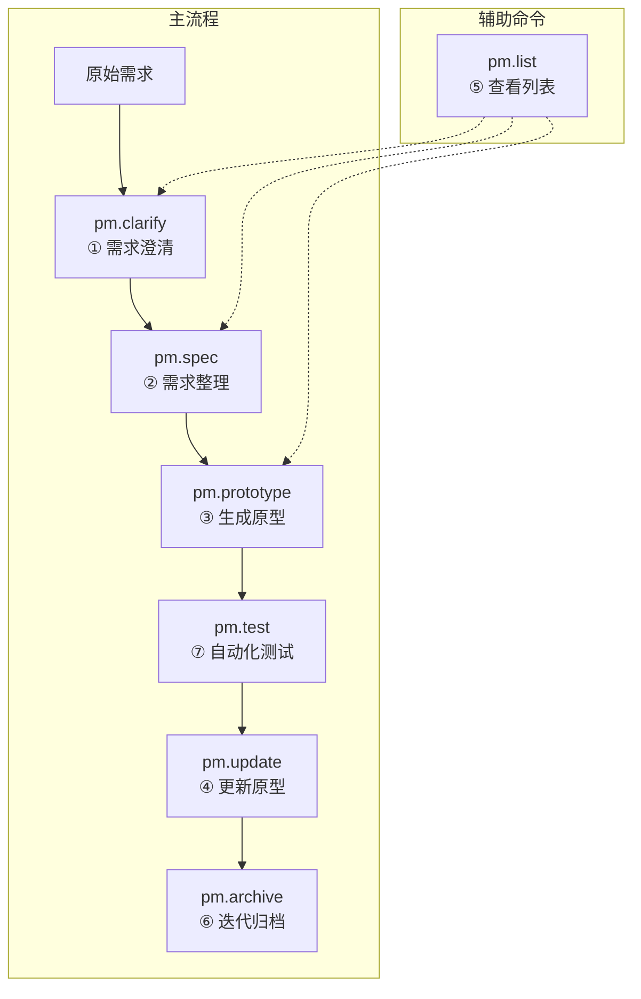

# 产品原型约束规范

> 本文档定义产品经理生成 HTML 原型时必须遵守的技术约束和规范。

## 〇、命令体系总览



| 命令 | 作用 | 产出物 |
|------|------|--------|
| `/pm.clarify` | 需求澄清 | `{功能名}-澄清.md` |
| `/pm.spec` | 需求整理 | `{功能名}-需求.md` |
| `/pm.prototype` | 生成原型 | `{功能名}-prototype.html` |
| `/pm.update` | 更新文档/原型 | 更新后的文件 |
| `/pm.list` | 查看列表 | 状态报告 |
| `/pm.archive` | 迭代归档 | 迭代 README.md |
| `/pm.test` | 自动化测试 | 测试报告 |

### 快捷流程

| 场景 | 推荐流程 |
|------|----------|
| 需求明确 | `/pm.spec` → `/pm.prototype` |
| 需求模糊 | `/pm.clarify` → `/pm.spec` → `/pm.prototype` |
| 快速原型 | `/pm.prototype`（直接描述需求） |

---

## 一、核心约束

| 约束项 | 要求 | 说明 |
|--------|------|------|
| **单文件** | ✅ 必须 | CSS/JS 必须内联在 HTML 中 |
| **纯离线** | ✅ 必须 | 禁止使用任何 CDN 依赖 |
| **响应式** | ✅ 必须 | 支持桌面和移动端预览 |
| **可交互** | ✅ 必须 | 包含基本交互逻辑 |

---

## 二、HTML 结构规范

```html
<!DOCTYPE html>
<html lang="zh-CN">
<head>
    <meta charset="UTF-8">
    <meta name="viewport" content="width=device-width, initial-scale=1.0">
    <title>{功能名} - 原型</title>
    
    <!-- 必须的元信息（用于索引提取） -->
    <meta name="prototype-name" content="{功能名}">
    <meta name="prototype-iteration" content="{迭代名称}">
    <meta name="prototype-author" content="{产品经理}">
    <meta name="prototype-created" content="{创建日期}">
    <meta name="prototype-updated" content="{更新日期}">
    <meta name="prototype-description" content="{功能描述}">
    
    <style>
        /* 所有 CSS 必须写在这里 */
    </style>
</head>
<body>
    <!-- 原型内容 -->
    
    <script>
        /* 所有 JS 必须写在这里 */
    </script>
</body>
</html>
```

---

## 三、CSS 规范

### 3.1 基础重置（必须包含）

```css
* {
    margin: 0;
    padding: 0;
    box-sizing: border-box;
}
```

### 3.2 系统字体（必须使用）

```css
body {
    font-family: -apple-system, BlinkMacSystemFont, 'Segoe UI', 
                 'PingFang SC', 'Hiragino Sans GB', 'Microsoft YaHei', 
                 sans-serif;
    line-height: 1.6;
    color: #333;
}
```

### 3.3 响应式断点

| 断点 | 说明 |
|------|------|
| `max-width: 480px` | 移动端 |
| `max-width: 768px` | 平板 |
| `min-width: 769px` | 桌面 |

### 3.4 颜色规范

| 用途 | 颜色值 | 说明 |
|------|--------|------|
| 主色 | `#667eea` | 按钮、强调 |
| 辅助色 | `#764ba2` | 渐变配色 |
| 文字色 | `#333` | 主文本 |
| 次文字 | `#666` | 描述文本 |
| 灰色 | `#999` | 辅助信息 |
| 边框 | `#ddd` | 分割线 |
| 背景 | `#f5f5f5` | 页面背景 |
| 成功 | `#4caf50` | 成功状态 |
| 警告 | `#ff9800` | 警告状态 |
| 错误 | `#e74c3c` | 错误状态 |

### 3.5 禁止事项

- ❌ 禁止使用外部 CSS 文件
- ❌ 禁止使用 `@import`
- ❌ 禁止使用 CDN 字体（如 Google Fonts）
- ❌ 禁止使用 CSS 框架 CDN

---

## 四、JavaScript 规范

### 4.1 代码位置

- 所有 JS 代码写在 `</body>` 前的 `<script>` 标签内
- 使用 `DOMContentLoaded` 确保 DOM 加载完成

```javascript
document.addEventListener('DOMContentLoaded', function() {
    // 初始化代码
});
```

### 4.2 交互要求

必须包含的交互类型（根据原型类型选择）：

| 原型类型 | 必须交互 |
|----------|----------|
| 表单页 | 输入校验、提交反馈 |
| 列表页 | 搜索过滤、行点击 |
| 详情页 | 操作按钮响应 |
| 流程页 | 步骤切换、状态流转 |
| 仪表盘 | 数据刷新、图表交互 |

### 4.3 禁止事项

- ❌ 禁止使用外部 JS 文件
- ❌ 禁止使用 CDN 库（jQuery、Vue、React 等）
- ❌ 禁止使用 `eval()`
- ❌ 禁止使用 `document.write()`

---

## 五、原型类型规范

### 5.1 表单页

```
+---------------------------+
|         Header            |
+---------------------------+
|                           |
|  [ Label ]                |
|  +---------------------+  |
|  | Input               |  |
|  +---------------------+  |
|                           |
|  [ Label ]                |
|  +---------------------+  |
|  | Input               |  |
|  +---------------------+  |
|                           |
|  +---------------------+  |
|  |    Submit Button    |  |
|  +---------------------+  |
|                           |
+---------------------------+
```

### 5.2 列表页

```
+---------------------------+
|         Header            |
+---------------------------+
| [Search Input     ] [🔍]  |
+---------------------------+
| +-------+-------+-------+ |
| | Col1  | Col2  | Col3  | |
| +-------+-------+-------+ |
| | Data  | Data  | Data  | |
| | Data  | Data  | Data  | |
| | Data  | Data  | Data  | |
| +-------+-------+-------+ |
| [<] Page 1/10 [>]         |
+---------------------------+
```

### 5.3 详情页

```
+---------------------------+
| [←]     Title      [Edit] |
+---------------------------+
|                           |
|  +---------------------+  |
|  |    Info Card        |  |
|  |  Label: Value       |  |
|  |  Label: Value       |  |
|  +---------------------+  |
|                           |
|  +---------------------+  |
|  |    Action Buttons   |  |
|  +---------------------+  |
|                           |
+---------------------------+
```

### 5.4 流程页

```
+---------------------------+
|         Header            |
+---------------------------+
|                           |
|  ● ─── ○ ─── ○ ─── ○     |
|  Step1  Step2 Step3 Step4 |
|                           |
|  +---------------------+  |
|  |   Current Step      |  |
|  |   Content Area      |  |
|  +---------------------+  |
|                           |
|  [Prev]         [Next]    |
+---------------------------+
```

---

## 六、文件命名规范

| 文件类型 | 命名格式 | 示例 |
|----------|----------|------|
| 澄清文档 | `{功能名}-澄清.md` | `用户登录-澄清.md` |
| 需求文档 | `{功能名}-需求.md` | `用户登录-需求.md` |
| HTML原型 | `{功能名}-prototype.html` | `用户登录-prototype.html` |

---

## 七、目录结构规范

```
docs/prototypes/
├── index.html                              # 汇总索引页
└── {YYYY-MM}-{迭代名}/
    ├── README.md                           # 迭代概览
    ├── requirements/                       # 需求文档目录
    │   ├── {功能名}-澄清.md
    │   ├── {功能名}-需求.md
    │   └── {功能名}-附件/
    └── html/                               # HTML原型目录
        └── {功能名}-prototype.html
```

---

## 八、Git 提交规范

| 操作 | Commit 格式 |
|------|-------------|
| 新增澄清 | `pm(澄清): {功能名} - 需求澄清完成` |
| 新增需求 | `pm(需求): {功能名} - 需求整理完成` |
| 新增原型 | `pm(原型): {功能名} - 新增原型` |
| 更新原型 | `pm(更新): {功能名} - {修改简述}` |
| 迭代归档 | `pm(归档): {迭代名称} - 迭代归档完成` |

---

## 九、检查清单

生成原型前，AI 必须确认：

- [ ] HTML 为单文件，无外部依赖
- [ ] CSS 内联在 `<style>` 标签中
- [ ] JS 内联在 `<script>` 标签中
- [ ] 包含必要的 meta 元信息
- [ ] 使用系统字体，无 CDN 字体
- [ ] 响应式适配移动端
- [ ] 包含基本交互逻辑
- [ ] 文件命名符合规范
- [ ] 目录结构符合规范
