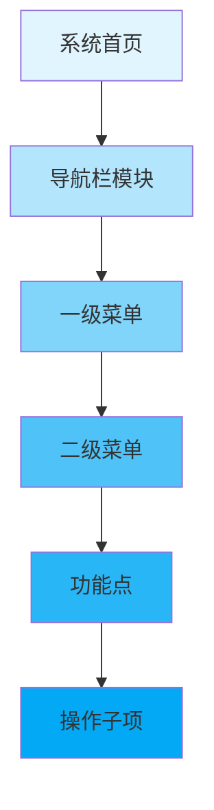
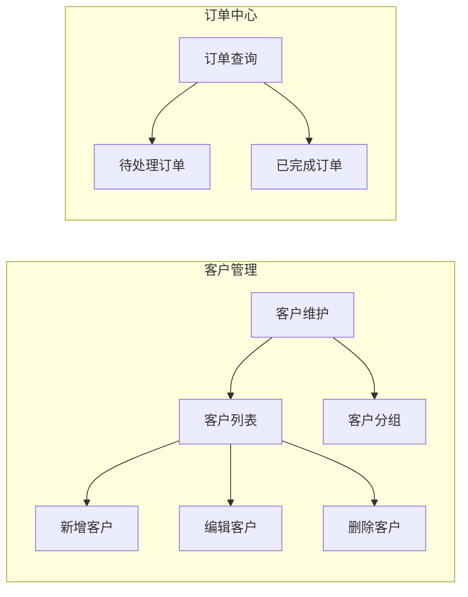
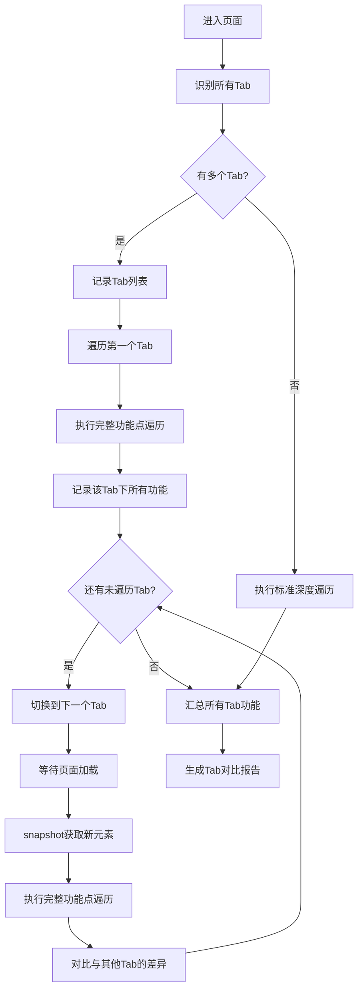
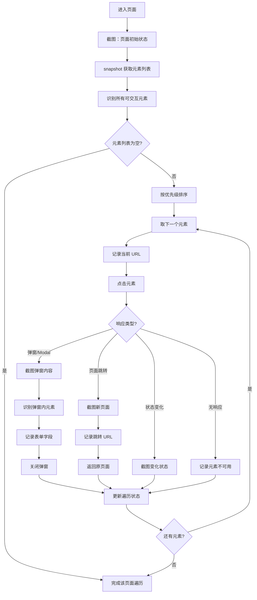
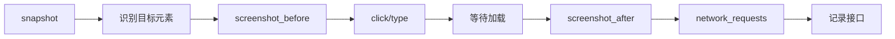

# 逆向功能设计与全量遍历推演规约

> 本规约定义基于 Playwright MCP 浏览器代理的系统功能逆向工程标准，适用于已有系统的功能梳理、设计逻辑还原、接口文档补全等场景。

## 核心原则 [NON-NEGOTIABLE]

### 所见即所得原则

```
┌─────────────────────────────────────────────────────────────────┐
│  ⚠️ 无可视化证据不记录                                           │
│                                                                 │
│  仅以 Playwright 浏览器代理的实时截图、录屏画面中呈现的内容为依据：  │
│  - 功能按钮、输入框、操作选项、跳转页面                            │
│  - 未在截图/录屏中出现的功能点、操作项                             │
│    → 一律不捏造、不推断、不补充                                   │
└─────────────────────────────────────────────────────────────────┘
```

| 原则 | 说明 | 违规示例 |
|------|------|----------|
| **可见即记录** | 只记录界面实际呈现的元素 | ❌ "根据经验，这里应该还有导出功能" |
| **无证据不补充** | 没有截图支撑的内容不纳入文档 | ❌ "虽然没看到，但一般系统都有..." |
| **状态如实记录** | 置灰、不可点击等状态如实描述 | ❌ "点不了可能是 bug，预期应该能点" |

### 执行载体约束

```yaml
浏览器代理: Playwright MCP (mcp1_browser_*)
截图工具: mcp1_browser_take_screenshot
快照工具: mcp1_browser_snapshot
导航工具: mcp1_browser_navigate, mcp1_browser_click
```

---

## 层级拆解规范 [REQUIRED]

### 深度优先拆解规则



### 节点唯一标识命名规范

```
格式: {导航模块}-{一级菜单}-{二级菜单}-{功能点}-{操作子项}

示例:
- 客户管理-客户维护-客户列表-新增客户
- 客户管理-客户维护-客户列表-新增客户-保存按钮
- 订单中心-订单查询-待处理订单-批量审核
```

| 层级 | 命名规则 | 示例 |
|------|----------|------|
| L1 导航模块 | 完整显示名称 | `客户管理` |
| L2 一级菜单 | 完整显示名称 | `客户管理-客户维护` |
| L3 二级菜单 | 完整显示名称 | `客户管理-客户维护-客户列表` |
| L4 功能点 | 按钮/链接文字 | `客户管理-客户维护-客户列表-新增客户` |
| L5 操作子项 | 表单项/按钮名 | `...-新增客户-保存按钮` |

### 层级图谱格式

使用 Mermaid flowchart 格式，存放于 `{文档目录}/hierarchy-graph.md`：



---

## 遍历执行规范 [REQUIRED]

### 遍历顺序

```
1. 导航栏模块：从左到右
2. 菜单层级：从上到下
3. 功能点：从左到右，从上到下
4. 操作子项：按界面布局顺序
```

### 遍历状态标记

| 状态 | 标记 | 说明 |
|------|------|------|
| 未遍历 | ⬜ | 尚未访问的节点 |
| 已遍历 | ✅ | 已完成操作并采集证据 |
| 不可操作 | ⚠️ | 可见但无法操作（置灰、权限不足等） |
| 需回溯 | 🔄 | 检测到遗漏，需要回溯补充 |

### 完整性校验规则

```python
# 伪代码：完整性校验
def verify_coverage(hierarchy_graph, traversal_log):
    visible_nodes = count_visible_nodes(hierarchy_graph)
    traversed_nodes = count_traversed_nodes(traversal_log)
    
    coverage_rate = traversed_nodes / visible_nodes * 100
    
    if coverage_rate < 100:
        missing_nodes = find_missing_nodes(hierarchy_graph, traversal_log)
        trigger_backtrack(missing_nodes)  # 自动回溯
    
    return coverage_rate
```

**覆盖率要求**：可见节点遍历覆盖率必须达到 **100%**

### 回溯机制

当检测到遗漏节点时：
1. 记录当前位置
2. 导航至遗漏节点的父级
3. 执行遗漏节点的遍历
4. 返回原位置继续

---

## 功能点深度遍历 [NON-NEGOTIABLE]

> ⚠️ **核心问题**：仅截图不点击 = 遗漏大量功能
> 
> **解决方案**：对每个页面执行**可交互元素全量点击遍历**

### 深度遍历原则

```
┌─────────────────────────────────────────────────────────────────┐
│  ⚠️ 每个页面必须执行功能点深度遍历                               │
│                                                                 │
│  不仅仅是截图，必须：                                            │
│  1. 识别页面所有可交互元素（按钮、链接、Tab、下拉菜单等）           │
│  2. 逐个点击并记录响应（弹窗、跳转、表单、状态变化）               │
│  3. 捕获触发的 API 请求                                          │
│  4. 返回原页面继续下一个元素                                     │
└─────────────────────────────────────────────────────────────────┘
```

### 可交互元素识别规则

| 元素类型 | 识别特征 | 遍历优先级 |
|----------|----------|------------|
| **主操作按钮** | 新增、添加、创建、导入、导出 | P0 - 必须点击 |
| **批量操作** | 批量删除、批量转移、批量导出 | P0 - 必须点击 |
| **Tab 切换** | 页面内 Tab 标签 | P0 - 必须点击**且每个Tab独立遍历** |
| **筛选/搜索** | 筛选按钮、高级搜索 | P1 - 应该点击 |
| **行操作** | 表格行内的编辑、删除、详情 | P1 - 至少点击一行 |
| **下拉菜单** | 更多操作、下拉选项 | P1 - 应该展开 |
| **链接** | 可点击的文字链接 | P2 - 选择性点击 |
| **图标按钮** | 设置、刷新、导出图标 | P2 - 选择性点击 |

---

## Tab 完整遍历规范 [NON-NEGOTIABLE]

> ⚠️ **核心问题**：只遍历默认Tab = 遗漏50%+功能
>
> **解决方案**：**每个Tab视为独立页面，都要完整遍历所有功能点**

### Tab 遍历原则

```
┌─────────────────────────────────────────────────────────────────┐
│  ⚠️ Tab 不是简单的视图切换，而是独立的功能上下文               │
│                                                                 │
│  示例："我的客户"页面有两个Tab：                                │
│    - [普通客户] Tab → 独立的功能按钮、筛选条件、行操作          │
│    - [合作伙伴推广客户] Tab → 可能有不同的按钮和操作            │
│                                                                 │
│  必须：切换到每个Tab后，重新执行完整的功能点遍历                │
└─────────────────────────────────────────────────────────────────┘
```

### Tab 遍历执行流程



### Tab 差异分析记录

每个页面的Tab遍历完成后，必须记录差异：

```json
{
  "page": "我的客户",
  "url": "/crm/client-partner/my-client",
  "tabs": [
    {
      "tab_name": "普通客户",
      "tab_index": 0,
      "data_count": 52747,
      "buttons": ["添加客户", "查重检测", "一键转移", "批量转移", "移入公海"],
      "filters": ["客户编码", "公司名称", "...共23个"],
      "row_actions": ["共享", "转移", "移入公海", "修改客户类别", "修改客户类型"],
      "table_columns": ["客户编码", "公司名称", "客户名称", "..."]
    },
    {
      "tab_name": "合作伙伴推广客户",
      "tab_index": 1,
      "data_count": 882,
      "buttons": ["添加客户", "查重检测", "一键转移", "批量转移", "移入公海", "批量变更客户类型"],
      "filters": ["客户编码", "公司名称", "..."],
      "row_actions": ["共享", "转移", "移入公海", "修改客户类别", "修改客户类型"],
      "table_columns": ["客户编码", "客户类型", "公司名称", "..."],
      "diff_from_tab0": {
        "added_buttons": ["批量变更客户类型"],
        "added_columns": ["客户类型", "客户类别", "关联合作伙伴", "代理商角色类型"]
      }
    }
  ]
}
```

### Tab 遍历检查清单

```markdown
## Tab 遍历检查清单

- [ ] 识别页面所有Tab（包括隐藏的）
- [ ] 每个Tab都已切换并截图
- [ ] 每个Tab下的所有按钮都已点击
- [ ] 每个Tab下的筛选条件都已记录
- [ ] 每个Tab下的表格列都已记录
- [ ] 每个Tab下的行操作都已测试
- [ ] Tab之间的功能差异已记录
```

---

## 业务流程完整遍历规范 [NON-NEGOTIABLE]

> ⚠️ **核心问题**：只打开弹窗看字段 ≠ 理解业务流程
>
> **解决方案**：对核心业务操作执行**完整流程遍历**（模拟真实用户操作）

### 流程遍历原则

```
┌─────────────────────────────────────────────────────────────────┐
│  ⚠️ 核心业务操作必须遍历完整流程                                │
│                                                                 │
│  示例："新增客户"的完整流程：                                   │
│    1. 点击"添加客户"按钮 → 弹窗打开                             │
│    2. 识别所有表单字段（类型、必填、默认值、校验规则）           │
│    3. 填写测试数据（或识别字段联动关系）                        │
│    4. 点击"确定"观察：                                          │
│       - 字段校验提示                                            │
│       - 必填项提示                                              │
│       - 提交后的反馈（成功提示/错误提示）                       │
│    5. 查看新增数据是否出现在列表中                              │
│    6. 点击新增数据查看详情页                                    │
│                                                                 │
│  注意：如使用测试数据，遍历后应清理（删除测试数据）              │
└─────────────────────────────────────────────────────────────────┘
```

### 需要完整流程遍历的操作类型

| 操作类型 | 流程步骤 | 遍历深度 |
|----------|----------|----------|
| **新增/创建** | 打开→填写→提交→验证→查看详情 | 完整流程 |
| **编辑/修改** | 打开→修改→保存→验证变更 | 完整流程 |
| **删除** | 选择→确认→验证删除 | 需确认弹窗 |
| **批量操作** | 选择多条→操作→验证结果 | 至少2条数据 |
| **状态变更** | 操作→确认→验证状态变化 | 完整流程 |
| **导入/导出** | 触发→选择文件/下载→验证结果 | 观察响应 |

### 流程遍历执行示例

```mermaid
flowchart TD
    subgraph 新增客户流程遍历
        A[点击"添加客户"] --> B[弹窗打开]
        B --> C[记录所有字段]
        C --> D{是否模拟填写?}
        
        D -->|是-测试环境| E[填写测试数据]
        E --> F[点击确定]
        F --> G{提交结果}
        G -->|成功| H[记录成功提示]
        H --> I[验证列表出现新数据]
        I --> J[点击新数据查看详情]
        J --> K[记录详情页内容]
        K --> L[删除测试数据]
        
        G -->|失败| M[记录错误提示]
        M --> N[记录校验规则]
        
        D -->|否-生产环境| O[只点击取消]
        O --> P[记录字段信息]
    end
```

### 字段联动关系识别

在填写表单时，需要识别字段间的联动关系：

```json
{
  "form_name": "添加客户",
  "field_dependencies": [
    {
      "trigger_field": "客户归属品牌",
      "trigger_value": "BUKA",
      "affected_fields": ["目标市场"],
      "effect": "目标市场选项根据品牌过滤"
    },
    {
      "trigger_field": "客户来源",
      "trigger_value": "市场分配/*",
      "affected_fields": ["来源标签"],
      "effect": "来源标签变为必填"
    }
  ],
  "validation_rules": [
    {"field": "企业邮箱", "rule": "邮箱格式校验"},
    {"field": "客户名称", "rule": "不能包含特殊字符"},
    {"field": "联系方式", "rule": "至少填写一种联系方式"}
  ]
}
```

### 流程遍历模式选择

```yaml
# 根据环境选择遍历模式
遍历模式:
  测试环境:
    - 完整流程遍历（包含数据创建）
    - 填写测试数据验证
    - 遍历后清理测试数据
  
  生产环境:
    - 观察模式（不创建数据）
    - 只打开弹窗记录字段
    - 通过现有数据验证编辑/详情流程
```

### 流程遍历记录格式

```json
{
  "flow_name": "新增客户",
  "flow_type": "create",
  "steps": [
    {
      "step": 1,
      "action": "点击添加客户按钮",
      "result": "弹窗打开",
      "screenshot": "flow-001-open-modal.png"
    },
    {
      "step": 2,
      "action": "识别表单字段",
      "result": {
        "total_fields": 12,
        "required_fields": 11,
        "field_types": {"input": 5, "select": 5, "cascader": 2}
      }
    },
    {
      "step": 3,
      "action": "填写测试数据",
      "test_data": {
        "客户名称": "测试客户_20260121",
        "客户归属品牌": "ITNIO",
        "..."
      }
    },
    {
      "step": 4,
      "action": "点击确定提交",
      "result": "提示：添加成功",
      "screenshot": "flow-002-success.png"
    },
    {
      "step": 5,
      "action": "验证列表数据",
      "result": "新数据出现在列表第一行",
      "screenshot": "flow-003-list-verify.png"
    },
    {
      "step": 6,
      "action": "清理测试数据",
      "result": "已删除测试客户"
    }
  ],
  "flow_summary": {
    "success": true,
    "api_calls": ["POST /api/customer/create", "GET /api/customer/list"],
    "duration": "约5秒"
  }
}
```

### 深度遍历执行流程



### 点击响应处理规范

| 响应类型 | 处理方式 | 记录内容 |
|----------|----------|----------|
| **弹窗/Modal** | 截图 → 识别内部元素 → 关闭 | 表单字段、按钮、必填项 |
| **抽屉/Drawer** | 截图 → 识别内部元素 → 关闭 | 表单字段、Tab、操作按钮 |
| **下拉菜单** | 截图展开状态 → 记录选项 → 收起 | 所有选项文本 |
| **页面跳转** | 截图 → 记录 URL → 返回 | 跳转目标、URL 规则 |
| **确认对话框** | 截图 → 点击取消 | 确认文案 |
| **Toast 提示** | 截图 → 记录文案 | 提示内容 |
| **状态变化** | 截图对比 | 变化前后差异 |
| **无响应/置灰** | 记录状态 | 不可用原因 |

### 弹窗/表单深度分析

当点击触发弹窗时，必须执行：

```
1. 截图弹窗完整内容
2. 识别表单字段：
   - 字段名称
   - 字段类型（输入框/下拉/日期/上传等）
   - 是否必填（*标记）
   - 默认值
3. 识别操作按钮：
   - 提交按钮（保存/确定/提交）
   - 取消按钮
   - 其他操作
4. 关闭弹窗（点击取消或X）
5. 返回原页面状态
```

### 表格行操作遍历

对于列表页面的表格：

```
1. 识别表格操作列
2. 点击第一行数据的操作按钮（编辑/查看/详情等）
3. 记录跳转或弹窗内容
4. 返回列表页
5. 如有"更多操作"下拉，展开并记录所有选项
```

### 深度遍历状态记录

每个功能点的遍历记录格式：

```json
{
  "element_id": "btn-add-customer",
  "element_text": "添加客户",
  "element_type": "button",
  "priority": "P0",
  "click_result": {
    "response_type": "modal",
    "modal_title": "新增客户",
    "form_fields": [
      {"name": "客户名称", "type": "input", "required": true},
      {"name": "客户类型", "type": "select", "required": true},
      {"name": "联系电话", "type": "input", "required": false}
    ],
    "buttons": ["保存", "取消"],
    "screenshot": "001-add-customer-modal.png",
    "api_triggered": ["POST /api/customer/validate"]
  },
  "traversed_at": "2026-01-21T10:00:00Z"
}
```

### 遍历完整性检查

每个页面遍历完成后，必须确认：

```markdown
## 页面遍历检查清单

- [ ] 所有 P0 按钮已点击
- [ ] 所有 Tab 已切换
- [ ] 至少一行数据的行操作已点击
- [ ] 所有下拉菜单已展开
- [ ] 所有弹窗/表单字段已记录
- [ ] 触发的 API 已捕获
```

---

## 防遗漏机制 [NON-NEGOTIABLE]

> ⚠️ **大系统遍历的核心保障**：状态持久化 + 检查点 + 强制校验

### 状态持久化

每次操作前后必须读写 `traversal-state.json`，确保 AI 不会"忘记"进度：

```json
{
  "system_name": "昆仑系统",
  "total_nodes": 156,
  "traversed_count": 45,
  "current_node": "客户管理-客户维护-客户列表",
  "pending_nodes": [
    "客户管理-客户维护-新增客户",
    "客户管理-客户维护-编辑客户",
    "..."
  ],
  "completed_nodes": [
    {"id": "客户管理", "status": "✅", "timestamp": "2026-01-21T09:00:00Z"},
    "..."
  ],
  "last_checkpoint": "checkpoint-20260121-090500.json",
  "last_update": "2026-01-21T09:15:00Z"
}
```

**强制规则**：
1. **每步开始前**：必须读取 `traversal-state.json`
2. **每步完成后**：必须更新 `traversal-state.json`
3. **AI 不得依赖记忆**：所有进度信息从文件读取

### 检查点机制

每完成 **5 个节点**，自动创建检查点：

```
checkpoints/
├── checkpoint-20260121-090000.json  # 初始状态
├── checkpoint-20260121-090500.json  # 5 个节点后
├── checkpoint-20260121-091000.json  # 10 个节点后
└── ...
```

**断点续传**：
```bash
# 中断后恢复
/speckit.reverse-traverse --resume

# 从指定检查点恢复
/speckit.reverse-traverse --checkpoint checkpoint-20260121-090500.json
```

### 分批遍历策略

对于大系统（节点数 > 50），强制分批遍历：

| 系统规模 | 节点数 | 策略 |
|----------|--------|------|
| 小型 | < 50 | 一次性遍历 |
| 中型 | 50-150 | 按导航模块分批 |
| 大型 | > 150 | 按一级菜单分批 |

```bash
# 分批遍历示例
/speckit.reverse-traverse --batch "客户管理"
/speckit.reverse-traverse --batch "订单中心"
/speckit.reverse-traverse --batch "系统设置"
```

### 强制校验规则

**遍历前校验**：
```
1. 读取 hierarchy-graph.md，统计总节点数 N
2. 读取 traversal-state.json，获取待遍历列表
3. 确认待遍历数 = N - 已遍历数
4. 如有不一致，报错并停止
```

**遍历中校验**（每 5 个节点）：
```
1. 保存检查点
2. 输出进度：已遍历 X/N (Y%)
3. 列出接下来 5 个待遍历节点
4. 等待确认后继续
```

**遍历后校验**：
```
1. 统计 traversal-state.json 中的已遍历数
2. 对比 hierarchy-graph.md 总节点数
3. 如果 < 100%，列出所有遗漏节点
4. 强制执行回溯遍历
5. 重复直到 100%
```

### 遗漏节点追踪表

每次遍历结束必须生成 `missing-nodes-check.md`：

```markdown
# 遗漏节点检查报告

## 校验结果

| 项目 | 数值 |
|------|------|
| 图谱总节点数 | 156 |
| 已遍历节点数 | 156 |
| 遗漏节点数 | 0 |
| **覆盖率** | **100%** ✅ |

## 遗漏节点列表（如有）

| 节点标识 | 层级 | 父节点 | 遗漏原因 | 处理状态 |
|----------|------|--------|----------|----------|
| - | - | - | - | - |

## 校验通过确认

- [x] 所有导航模块已遍历
- [x] 所有一级菜单已遍历
- [x] 所有二级菜单已遍历
- [x] 所有功能点已遍历
- [x] 所有操作子项已遍历
```

---

## 证据采集规范 [NON-NEGOTIABLE]

### 截图要求

| 项目 | 要求 |
|------|------|
| **触发时机** | 每个功能点操作前后各一张 |
| **命名格式** | `{节点标识}_{序号}_{before/after}.png` |
| **存储位置** | 与文档同级目录下的 `screenshots/` |
| **内容要求** | 必须包含完整的操作区域和上下文 |

```
screenshots/
├── 客户管理-客户维护-客户列表_001_before.png
├── 客户管理-客户维护-客户列表_002_after.png
├── 客户管理-客户维护-新增客户_001_before.png
└── 客户管理-客户维护-新增客户_002_after.png
```

### 素材编号规则

```
格式: {节点简码}-{4位序号}
示例: KHGL-KHWH-KHLB-0001

编号索引表:
| 节点标识 | 简码 | 素材编号范围 |
|----------|------|--------------|
| 客户管理-客户维护-客户列表 | KHGL-KHWH-KHLB | 0001-0099 |
| 客户管理-客户维护-新增客户 | KHGL-KHWH-XZKH | 0001-0099 |
```

### 素材-记录绑定

每条功能记录必须包含素材引用：

```markdown
### 功能点：新增客户

- **节点标识**: 客户管理-客户维护-客户列表-新增客户
- **素材编号**: KHGL-KHWH-XZKH-0001 ~ 0003
- **截图**: 
  - 
  - 
```

---

## 接口捕获规范 [REQUIRED]

### 捕获内容

通过 Playwright 的网络请求监控捕获：

| 字段 | 说明 | 必填 |
|------|------|------|
| URL | 接口地址 | ✅ |
| Method | 请求方式（GET/POST/PUT/DELETE） | ✅ |
| Headers | 关键请求头（Authorization, Content-Type） | ✅ |
| Request Body | 请求参数 | ✅ |
| Response Status | 响应状态码 | ✅ |
| Response Body | 响应内容（脱敏处理） | ✅ |
| 触发操作 | 对应的界面操作 | ✅ |
| 素材编号 | 操作时的截图编号 | ✅ |

### 接口记录格式

```markdown
#### API-001: 获取客户列表

| 属性 | 值 |
|------|------|
| **URL** | `/api/v1/customers` |
| **Method** | GET |
| **触发操作** | 点击"客户列表"菜单 |
| **素材编号** | KHGL-KHWH-KHLB-0001 |

**Request Headers**:
```json
{
  "Authorization": "Bearer ***",
  "Content-Type": "application/json"
}
```

**Response** (Status: 200):
```json
{
  "code": 0,
  "data": {
    "list": [...],
    "total": 100
  }
}
```
```

---

## 特殊场景处理 [RECOMMENDED]

### 不可操作节点

| 场景 | 处理方式 |
|------|----------|
| 权限不足（置灰） | 记录界面状态，标记为 ⚠️，纳入任务清单 |
| 点击无响应 | 重试 3 次，仍无响应则记录状态 |
| 弹窗/遮罩阻挡 | 先处理弹窗，再继续遍历 |
| 页面加载失败 | 记录错误信息，纳入任务清单 |

### 动态内容处理

| 场景 | 处理方式 |
|------|----------|
| 分页列表 | 记录首页内容，标注"更多数据需翻页" |
| 懒加载 | 滚动触发加载后再截图 |
| 异步弹窗 | 等待弹窗完全加载后截图 |

---

## 文档输出规范 [REQUIRED]

### 输出物清单

| 文档 | 文件名 | 说明 |
|------|--------|------|
| 层级结构表 | `hierarchy-structure.md` | 节点标识、遍历状态、操作路径、素材编号 |
| 遍历路径清单 | `traversal-paths.md` | 全量路径、覆盖率报告 |
| 功能操作手册 | `feature-manual.md` | 操作步骤、截图、流程说明 |
| 接口映射清单 | `api-mapping.md` | 功能-接口对应关系、接口详情 |
| 任务计划清单 | `task-list.md` | 待跟进事项、优先级、执行方式 |

### 目录结构 [NON-NEGOTIABLE]

**核心原则**：以**模块/菜单**作为目录层级，文档按功能归属存放

```
docs/reverse/{系统名称}-{日期}/
├── index.md                           # 系统级索引与追溯入口
├── traversal-state.json               # 全局遍历状态
├── hierarchy-graph.md                 # 系统级层级图谱（全貌）
│
├── {导航模块}/                         # L1: 导航模块目录
│   ├── index.md                       # 模块索引
│   ├── hierarchy-graph.md             # 模块层级图谱
│   │
│   └── {一级菜单}/                     # L2: 一级菜单目录
│       ├── index.md                   # 一级菜单索引
│       ├── feature-manual.md          # 该菜单下功能手册
│       ├── api-mapping.md             # 该菜单下接口映射
│       │
│       └── {二级菜单}/                 # L3: 二级菜单目录（可选）
│           ├── feature-manual.md      # 功能手册
│           ├── api-mapping.md         # 接口映射
│           └── screenshots/           # 截图目录
│               ├── 001-list.png
│               ├── 002-add-form.png
│               └── ...
│
└── _shared/                           # 共享资源目录
    ├── screenshots/                   # 系统级截图（登录、首页等）
    └── api-common.md                  # 公共接口
```

### 目录命名规范

| 层级 | 命名规则 | 示例 |
|------|----------|------|
| 系统根目录 | `{系统名称}-{YYYYMMDD}` | `kunlun-20260121` |
| 导航模块 | 菜单原文（去特殊字符） | `销售管理`、`财务中心` |
| 一级菜单 | 菜单原文（去特殊字符） | `客户与合作伙伴` |
| 二级菜单 | 菜单原文（去特殊字符） | `我的客户`、`公海` |
| 截图文件 | `{3位序号}-{功能描述}.png` | `001-list.png` |

### 特殊字符处理

```
原始名称                  →  目录名称
客户&合作伙伴             →  客户与合作伙伴
数据分析(新)              →  数据分析-新
市场推广分析-新            →  市场推广分析-新
```

### 示例：昆仑系统

```
docs/reverse/kunlun-20260121/
├── index.md
├── traversal-state.json
├── hierarchy-graph.md
│
├── 销售管理/
│   ├── index.md
│   ├── hierarchy-graph.md
│   │
│   ├── 客户与合作伙伴/
│   │   ├── index.md
│   │   ├── feature-manual.md
│   │   ├── api-mapping.md
│   │   │
│   │   ├── 我的客户/
│   │   │   ├── feature-manual.md
│   │   │   └── screenshots/
│   │   │       ├── 001-list.png
│   │   │       └── 002-add-dialog.png
│   │   │
│   │   ├── 合作伙伴/
│   │   │   ├── feature-manual.md
│   │   │   └── screenshots/
│   │   │
│   │   ├── 黑名单/
│   │   │   ├── feature-manual.md
│   │   │   └── screenshots/
│   │   │
│   │   └── 公海/
│   │       ├── feature-manual.md
│   │       └── screenshots/
│   │
│   ├── 数据分析/
│   │   └── ...
│   │
│   └── 业务操作/
│       └── ...
│
├── 采购管理/
│   └── ...
│
└── _shared/
    └── screenshots/
        ├── 001-login.png
        └── 002-home.png
```

### 追溯索引要求

`index.md` 必须包含：

```markdown
# {系统名称} 逆向文档索引

## 基本信息
| 项目 | 值 |
|------|------|
| 系统名称 | {名称} |
| 遍历日期 | {日期} |
| 可见节点总数 | {数量} |
| 已遍历节点 | {数量} |
| 覆盖率 | 100% |

## 快速导航
- [层级结构表](./hierarchy-structure.md)
- [层级图谱](./hierarchy-graph.md)
- [遍历路径](./traversal-paths.md)
- [功能手册](./feature-manual.md)
- [接口映射](./api-mapping.md)
- [任务清单](./task-list.md)

## 节点追溯索引

| 节点标识 | 遍历状态 | 素材编号 | 关联接口 |
|----------|----------|----------|----------|
| 客户管理-客户维护-客户列表 | ✅ | KHGL-KHWH-KHLB-0001~0005 | API-001 |
| ... | ... | ... | ... |
```

---

## Playwright MCP 工具使用指南

### 常用工具

| 工具 | 用途 |
|------|------|
| `mcp1_browser_navigate` | 导航到指定 URL |
| `mcp1_browser_snapshot` | 获取页面可访问性快照（推荐用于元素识别） |
| `mcp1_browser_take_screenshot` | 截取页面截图 |
| `mcp1_browser_click` | 点击元素 |
| `mcp1_browser_type` | 输入文本 |
| `mcp1_browser_network_requests` | 获取网络请求记录 |

### 标准操作流程



### 示例代码

```javascript
// 1. 获取页面快照，识别元素
const snapshot = await mcp1_browser_snapshot();

// 2. 截图（操作前）
await mcp1_browser_take_screenshot({ 
  filename: "KHGL-KHWH-KHLB-0001_before.png" 
});

// 3. 点击目标元素
await mcp1_browser_click({ 
  element: "新增客户按钮", 
  ref: "button[data-action='add']" 
});

// 4. 等待页面响应
await mcp1_browser_wait_for({ time: 2 });

// 5. 截图（操作后）
await mcp1_browser_take_screenshot({ 
  filename: "KHGL-KHWH-KHLB-0002_after.png" 
});

// 6. 获取网络请求
const requests = await mcp1_browser_network_requests();
```

---

## 版本历史

| 版本 | 日期 | 变更说明 |
|------|------|----------|
| v1.0 | 2026-01-21 | 初始版本 |
