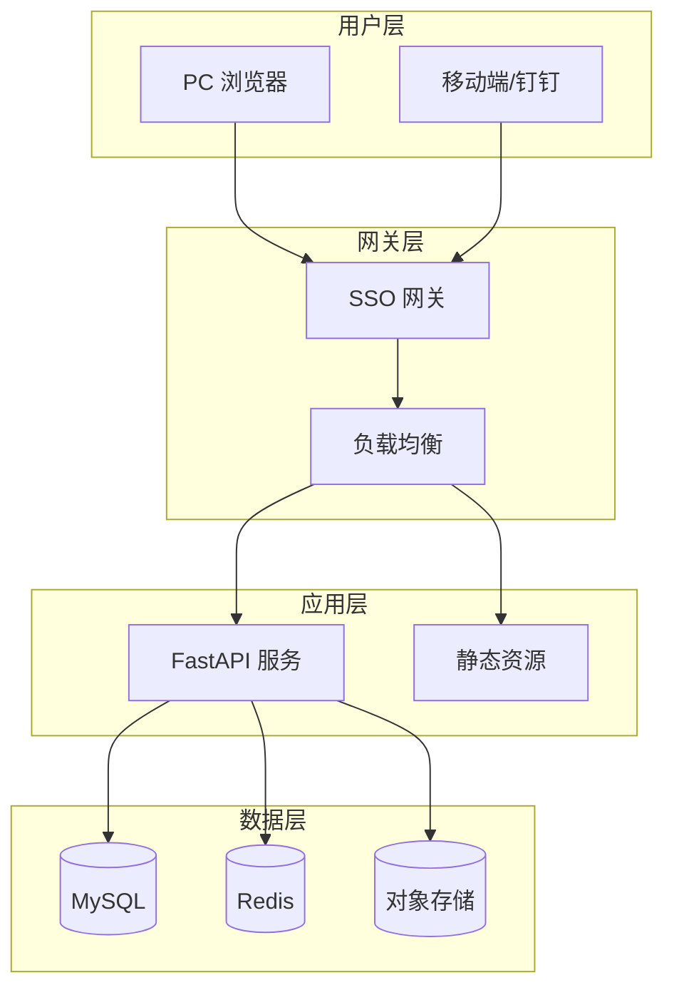
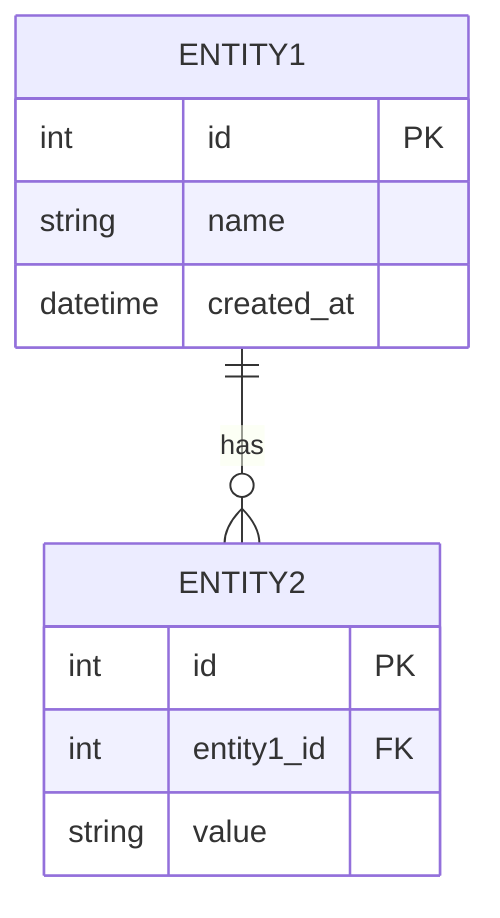
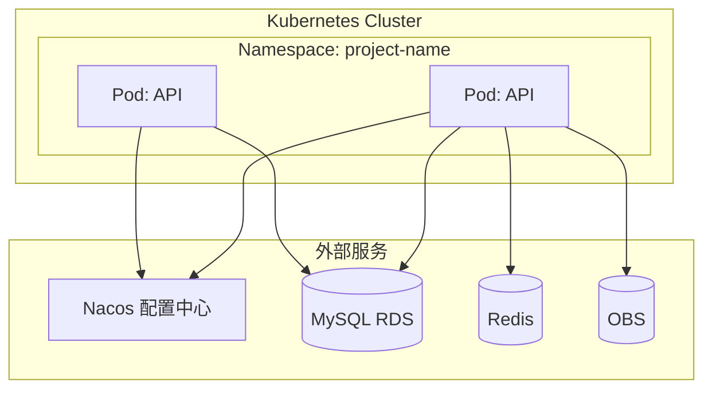

# 架构设计方案: [项目/功能名称]

**版本**: V1.0  
**创建日期**: [DATE]  
**状态**: 草稿 | 评审中 | 已定稿  
**架构师**: [NAME]

---

## 一、架构概述

### 1.1 设计目标

| 目标 | 描述 | 度量指标 |
|------|------|----------|
| **可用性** | [描述] | [如：99.9% SLA] |
| **可扩展性** | [描述] | [如：支持水平扩展] |
| **可维护性** | [描述] | [如：模块化设计] |
| **安全性** | [描述] | [如：零信任架构] |

### 1.2 架构约束

> 以下约束来自 `constitution.md`，不可变更

- [ ] 遵循 DDD 四层架构
- [ ] 前后端一体化部署
- [ ] 使用 Nacos 统一配置管理
- [ ] 使用 SSO 单点登录认证

### 1.3 技术选型

| 层级 | 技术 | 版本 | 选型理由 |
|------|------|------|----------|
| **前端** | React + TypeScript | 18.x / 5.x | 组件化、类型安全 |
| **UI 库** | Ant Design | 5.x | 企业级 UI 组件 |
| **状态管理** | Zustand | 4.x | 轻量、简洁 |
| **后端** | FastAPI | 0.100+ | 高性能、自动文档 |
| **ORM** | SQLAlchemy | 2.x | 异步支持、类型安全 |
| **数据库** | MySQL | 8.0 | 事务支持、成熟稳定 |
| **缓存** | Redis | 7.x | 高性能、分布式 |
| **对象存储** | OBS | - | 文件存储、加密 |

---

## 二、系统架构

### 2.1 整体架构图



### 2.2 DDD 分层架构

```
┌─────────────────────────────────────────────────────────────────────┐
│                        Interface Layer (接口层)                      │
│                   app/api/v1/endpoints/*.py                         │
│               Controller/Router, DTO 序列化/反序列化                  │
├─────────────────────────────────────────────────────────────────────┤
│                       Application Layer (应用层)                     │
│                        app/services/*.py                            │
│                用例编排、服务协调、事务管理、权限校验                   │
├─────────────────────────────────────────────────────────────────────┤
│                        Domain Layer (领域层)                         │
│                  app/models/*.py + app/domain/*.py                  │
│             领域模型、业务规则、聚合根、领域事件、值对象                 │
├─────────────────────────────────────────────────────────────────────┤
│                     Infrastructure Layer (基础设施层)                │
│                 app/db/ + app/utils/ + app/core/                    │
│              数据库访问、外部服务、配置管理、工具类                     │
└─────────────────────────────────────────────────────────────────────┘
```

### 2.3 目录结构

```
backend/app/
├── api/v1/endpoints/        # 接口层：API 路由
│   ├── auth.py              # 认证接口
│   └── [module].py          # 业务接口
├── schemas/                  # 接口层：DTO 定义
│   └── [module].py          # DTO 模型
├── services/                 # 应用层：业务服务
│   └── [module]_service.py  # 业务服务
├── models/                   # 领域层：数据模型
│   └── [module].py          # 实体模型
├── domain/                   # 领域层：业务规则 (可选)
│   ├── events/              # 领域事件
│   └── rules/               # 业务规则
├── db/                       # 基础设施层：数据库
│   ├── session.py           # 数据库会话
│   └── base.py              # 基类
├── core/                     # 基础设施层：核心配置
│   ├── config.py            # 配置管理
│   └── security.py          # 安全工具
└── utils/                    # 基础设施层：工具类
    └── [util].py            # 工具模块

frontend/src/
├── components/               # 公共组件
├── pages/                    # 页面
│   ├── pc/                  # PC 端页面
│   └── mobile/              # 移动端页面
├── services/                 # API 服务
├── stores/                   # 状态管理 (Zustand)
├── types/                    # TypeScript 类型
├── utils/                    # 工具函数
└── router/                   # 路由配置
```

---

## 三、数据库设计

### 3.1 ER 图



### 3.2 核心表设计

#### 表: [table_name]

| 字段 | 类型 | 约束 | 说明 |
|------|------|------|------|
| `id` | INT | PK, AUTO_INCREMENT | 主键 |
| `name` | VARCHAR(100) | NOT NULL | 名称 |
| `status` | ENUM | NOT NULL | 状态 |
| `created_at` | DATETIME | NOT NULL | 创建时间 |
| `updated_at` | DATETIME | NOT NULL | 更新时间 |

**索引设计**:

| 索引名 | 字段 | 类型 | 说明 |
|--------|------|------|------|
| `idx_[table]_status` | status | BTREE | 状态查询 |
| `uk_[table]_name` | name | UNIQUE | 名称唯一 |

---

## 四、API 设计

### 4.1 API 规范

| 规范项 | 约定 |
|--------|------|
| **路径前缀** | `/api/v1/` |
| **命名风格** | 小写 + 连字符 (kebab-case) |
| **HTTP 方法** | GET 查询, POST 创建, PUT 更新, DELETE 删除 |
| **响应格式** | 统一 JSON 格式 |

### 4.2 接口清单

| 模块 | 方法 | 路径 | 描述 | 权限 |
|------|------|------|------|------|
| **[模块1]** | GET | `/api/v1/[resource]` | 获取列表 | [角色] |
| | POST | `/api/v1/[resource]` | 创建资源 | [角色] |
| | GET | `/api/v1/[resource]/{id}` | 获取详情 | [角色] |
| | PUT | `/api/v1/[resource]/{id}` | 更新资源 | [角色] |
| | DELETE | `/api/v1/[resource]/{id}` | 删除资源 | [角色] |

### 4.3 接口详细设计

#### [POST] /api/v1/[resource]

**描述**: [接口描述]

**请求体**:
```json
{
  "field1": "string",
  "field2": 123
}
```

**响应体**:
```json
{
  "code": 0,
  "message": "success",
  "data": {
    "id": 1,
    "field1": "string"
  }
}
```

**错误码**:

| 错误码 | 描述 | 处理建议 |
|--------|------|----------|
| 400 | 参数错误 | 检查请求参数 |
| 401 | 未认证 | 重新登录 |
| 403 | 无权限 | 联系管理员 |

---

## 五、安全设计

### 5.1 认证授权

| 项目 | 方案 |
|------|------|
| **认证方式** | SSO 单点登录 (satoken Cookie) |
| **授权模型** | RBAC 角色权限 |
| **会话管理** | SSO 网关统一管理 |

### 5.2 数据安全

| 项目 | 方案 |
|------|------|
| **传输加密** | 全链路 HTTPS |
| **存储加密** | OBS SSE-KMS |
| **敏感数据** | 脱敏处理，禁止日志打印 |

### 5.3 审计日志

| 操作类型 | 记录内容 |
|----------|----------|
| 登录/登出 | 用户、时间、IP |
| 数据变更 | 操作人、变更前后值 |
| 关键操作 | 操作详情、结果 |

---

## 六、部署架构

### 6.1 部署拓扑



### 6.2 资源配置

| 环境 | CPU Request | CPU Limit | Memory Request | Memory Limit | 副本数 |
|------|-------------|-----------|----------------|--------------|--------|
| 开发 | 200m | 1000m | 512Mi | 1.5Gi | 1 |
| 生产 | 100m | 3000m | 256Mi | 5Gi | 2+ |

### 6.3 配置管理

| 配置类型 | 管理方式 | 说明 |
|----------|----------|------|
| 应用配置 | Nacos | 数据库、SSO、OBS 等 |
| 环境变量 | Helm Values | NACOS_HOST、ENVIRONMENT 等 |
| 敏感配置 | Nacos 加密 | 密码、密钥等 |

---

## 七、非功能设计

### 7.1 性能设计

| 指标 | 目标 | 实现方案 |
|------|------|----------|
| 响应时间 | P95 < 500ms | 数据库索引优化、Redis 缓存 |
| 吞吐量 | > 1000 QPS | 水平扩展、连接池 |
| 并发数 | > 100 | 异步处理、限流 |

### 7.2 可靠性设计

| 指标 | 目标 | 实现方案 |
|------|------|----------|
| 可用性 | 99.9% | 多副本、健康检查 |
| 容错 | 单点故障恢复 | K8S 自动重启 |
| 备份 | 每日全量 | 华为云 CBR |

---

## 八、附录

### 8.1 技术选型对比

| 方案 | 优点 | 缺点 | 结论 |
|------|------|------|------|
| 方案A | [优点] | [缺点] | ✅ 采用 |
| 方案B | [优点] | [缺点] | ❌ 放弃 |

### 8.2 参考文档

- [constitution.md](constitution.md) - 项目规约
- [产品设计方案](product.md) - 产品需求

---

**变更记录**:

| 版本 | 日期 | 变更内容 | 作者 |
|------|------|----------|------|
| V1.0 | [DATE] | 初稿 | [NAME] |
