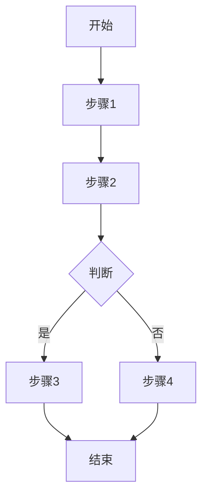
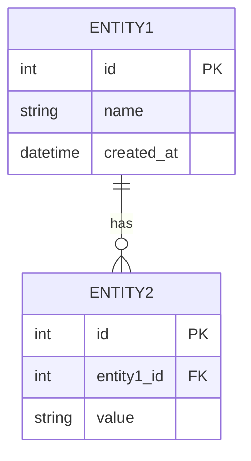

# 功能规格：[功能名称]

**版本**: V1.0  
**创建日期**: [DATE]  
**状态**: 草稿 | 评审中 | 已定稿  
**作者**: [NAME]

---

## 一、功能概述

### 1.1 背景与目标

[描述功能的业务背景、解决的问题、预期目标]

### 1.2 用户故事

```
作为 [角色]
我希望 [功能]
以便 [价值]
```

### 1.3 成功标准

| 指标 | 目标值 | 衡量方式 |
|------|--------|----------|
| [指标1] | [值] | [方式] |
| [指标2] | [值] | [方式] |

---

## 二、功能需求

### 2.1 核心功能

| 编号 | 功能点 | 优先级 | 描述 |
|------|--------|--------|------|
| F001 | [功能1] | P0 | [描述] |
| F002 | [功能2] | P1 | [描述] |
| F003 | [功能3] | P2 | [描述] |

### 2.2 用户流程



### 2.3 界面原型

[描述界面布局、交互方式，可附加原型图链接]

---

## 三、数据需求

### 3.1 数据模型



### 3.2 数据字典

| 字段 | 类型 | 必填 | 说明 |
|------|------|------|------|
| `id` | INT | ✅ | 主键 |
| `name` | VARCHAR(100) | ✅ | 名称 |
| `status` | ENUM | ✅ | 状态 |

---

## 四、非功能需求

| 类型 | 要求 |
|------|------|
| **性能** | [如：列表加载 < 500ms] |
| **并发** | [如：支持 100 并发] |
| **安全** | [如：需要权限控制] |
| **兼容** | [如：Chrome 90+] |

---

## 五、验收标准

- [ ] 功能点 F001 验收通过
- [ ] 功能点 F002 验收通过
- [ ] 性能测试通过
- [ ] 安全测试通过
- [ ] 用户体验符合预期

---

## 六、附录

### 6.1 相关文档

- [技术方案](./plan.md)
- [API 契约](./contracts/api-spec.yaml)
- [任务清单](./tasks.md)

### 6.2 变更记录

| 版本 | 日期 | 内容 | 作者 |
|------|------|------|------|
| V1.0 | [DATE] | 初稿 | [NAME] |
