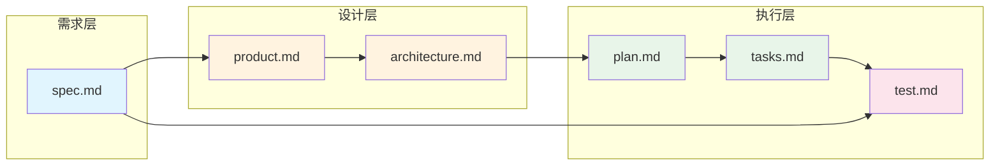

# {项目名称} - 智能文档索引

<!-- 
  🤖 AI CONTEXT BLOCK - AI 优先读取此区块
  ═══════════════════════════════════════════
  本区块为 AI 提供快速理解项目的核心上下文。
  每次迭代更新时，必须同步更新此区块。
-->

## 🎯 AI Quick Context

> **⚠️ AI 必读**：开始任何任务前，先阅读此区块获取最新上下文。

### 当前状态

| 项目 | 值 |
|------|-----|
| **当前迭代** | {迭代名称} |
| **迭代日期** | {YYYY-MM-DD} |
| **开发阶段** | ① 需求 / ② 产品 / ③ 架构 / ④ 计划 / ⑤ 任务 / ⑥ 开发 / ⑦ 单测 / ⑧ 用例 / ⑨ 测试 / ⑩ 报告 |
| **活跃文档数** | {N} 个 |

### 核心约束摘要

<!-- 从 constitution.md 提取的关键约束，避免 AI 重复读取完整文档 -->

```yaml
技术栈:
  后端: Python 3.12 + FastAPI
  前端: React 18 + TypeScript + Ant Design
  数据库: MySQL 8.0
  部署: K8S + Nacos

强制规则:
  - TDD 测试先行
  - DDD 分层架构
  - 单层 SSO 鉴权（禁止 JWT）
  - 前后端单镜像部署
```

### 当前迭代摘要

<!-- 50字以内描述当前迭代的核心目标 -->

**目标**: {一句话描述}

**关键变更**:
- {变更1}
- {变更2}

**待解决**:
- [ ] {待解决项1}

---

## 📚 活跃文档（.specify/memory/）

> **规则**: 此目录仅保留**当前迭代**的活跃文档，历史版本归档到 `docs/archive/`

| 文档 | 版本 | 状态 | 最后更新 | 摘要 |
|------|------|------|----------|------|
| [constitution.md](constitution.md) | - | 🔒 锁定 | - | 不可变规约 |
| [spec.md](spec.md) | V{x.y} | ✅ 活跃 | {日期} | {20字摘要} |
| [product.md](product.md) | V{x.y} | ✅ 活跃 | {日期} | {20字摘要} |
| [architecture.md](architecture.md) | V{x.y} | ✅ 活跃 | {日期} | {20字摘要} |
| [plan.md](plan.md) | V{x.y} | ✅ 活跃 | {日期} | {20字摘要} |
| [tasks.md](tasks.md) | V{x.y} | ✅ 活跃 | {日期} | {20字摘要} |
| [test.md](test.md) | V{x.y} | ✅ 活跃 | {日期} | {20字摘要} |

### 文档状态说明

| 状态 | 含义 | AI 行为 |
|------|------|---------|
| 🔒 锁定 | 不可变更 | 必须遵守 |
| ✅ 活跃 | 当前有效 | 可引用、可更新 |
| ⏸️ 暂停 | 暂时搁置 | 不引用 |
| 📦 已归档 | 历史版本 | 仅追溯时引用 |

---

## 🗂️ 迭代归档（docs/archive/）

> **规则**: 每个迭代完成后，将文档快照归档到此目录

| 迭代 | 日期 | 状态 | 主要内容 | 归档路径 |
|------|------|------|----------|----------|
| {迭代1} | {日期} | 📦 已归档 | {摘要} | [查看](../../docs/archive/{迭代1}/) |
| {迭代2} | {日期} | 📦 已归档 | {摘要} | [查看](../../docs/archive/{迭代2}/) |

---

## 🔗 文档依赖图

> AI 更新文档时，必须检查依赖关系，确保上游变更同步到下游



### 变更传播规则

| 变更源 | 影响范围 | 必须更新 |
|--------|----------|----------|
| spec.md | 全链路 | product → architecture → plan → tasks → test |
| product.md | 设计+执行 | architecture → plan → tasks → test |
| architecture.md | 执行层 | plan → tasks → test |
| plan.md | 任务+测试 | tasks → test |
| tasks.md | 测试 | test |

---

## 📋 变更历史

| 日期 | 版本 | 变更类型 | 变更内容 | 操作人 |
|------|------|----------|----------|--------|
| {日期} | {版本} | {小/中/大} | {摘要} | AI/人工 |

---

**索引版本**: {x.y.z} | **最后更新**: {YYYY-MM-DD HH:mm}
