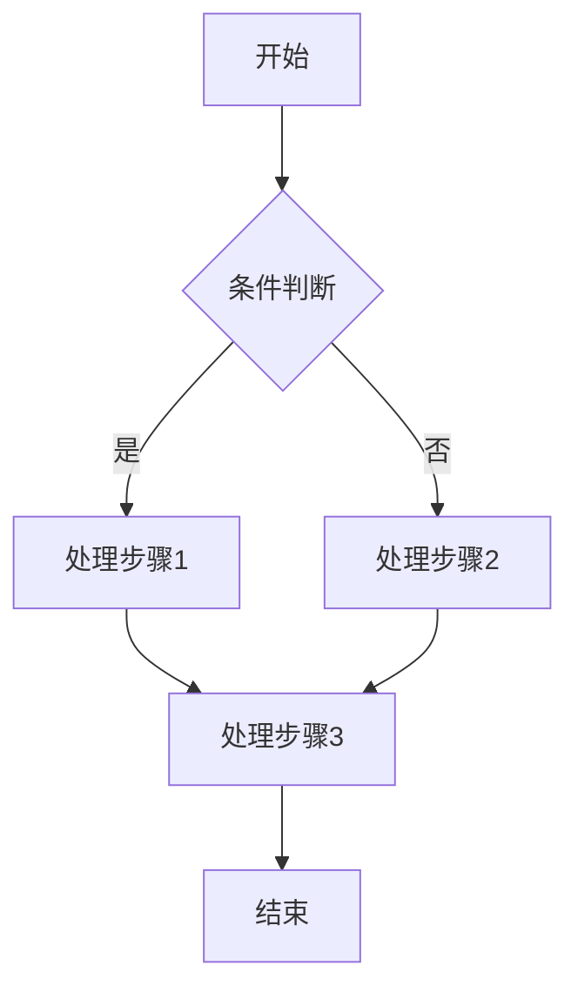

# 产品设计方案: [产品/功能名称]

**版本**: V1.0  
**创建日期**: [DATE]  
**状态**: 草稿 | 评审中 | 已定稿  
**产品负责人**: [NAME]

---

## 一、产品概述

### 1.1 背景与痛点

<!--
  描述当前业务场景中存在的问题和痛点
  - 用户目前如何完成这项工作？
  - 现有方案的主要问题是什么？
  - 为什么需要这个产品/功能？
-->

[描述业务背景和用户痛点]

### 1.2 产品目标

| 目标类型 | 描述 | 成功指标 |
|----------|------|----------|
| **业务目标** | [如：提升效率] | [如：处理时间减少 50%] |
| **用户目标** | [如：简化操作] | [如：操作步骤从 10 步减少到 3 步] |
| **技术目标** | [如：系统稳定] | [如：可用性 > 99.9%] |

### 1.3 用户角色

| 角色 | 描述 | 核心需求 | 使用频率 |
|------|------|----------|----------|
| **[角色1]** | [角色说明] | [核心需求] | [高/中/低] |
| **[角色2]** | [角色说明] | [核心需求] | [高/中/低] |

---

## 二、功能模块设计

### 2.1 功能清单

| 模块 | 功能点 | 优先级 | MVP | 描述 |
|------|--------|--------|-----|------|
| **[模块1]** | [功能1.1] | P0 | ✅ | [功能描述] |
| | [功能1.2] | P1 | ✅ | [功能描述] |
| **[模块2]** | [功能2.1] | P0 | ✅ | [功能描述] |
| | [功能2.2] | P2 | ❌ | [功能描述] |

> **优先级说明**: P0 = 必须有, P1 = 应该有, P2 = 可以有

### 2.2 模块详细设计

#### 模块一: [模块名称]

**功能描述**: [模块整体功能描述]

**核心功能**:

1. **[功能点1]**
   - 输入: [用户输入/触发条件]
   - 处理: [系统处理逻辑]
   - 输出: [预期结果]

2. **[功能点2]**
   - 输入: [用户输入/触发条件]
   - 处理: [系统处理逻辑]
   - 输出: [预期结果]

**业务规则**:

- BR-001: [业务规则描述]
- BR-002: [业务规则描述]

---

## 三、用户流程设计

### 3.1 核心业务流程

### 3.2 用户操作流程

| 步骤 | 用户操作 | 系统响应 | 异常处理 |
|------|----------|----------|----------|
| 1 | [用户操作] | [系统响应] | [异常情况及处理] |
| 2 | [用户操作] | [系统响应] | [异常情况及处理] |
| 3 | [用户操作] | [系统响应] | [异常情况及处理] |

---

## 四、界面原型

### 4.1 页面清单

| 页面 | 路径 | 描述 | 权限 |
|------|------|------|------|
| [页面1] | `/path1` | [页面描述] | [所需权限] |
| [页面2] | `/path2` | [页面描述] | [所需权限] |

### 4.2 页面原型说明

#### 页面一: [页面名称]

**页面布局**: [低保真描述或原型链接]

**核心元素**:

| 元素 | 类型 | 描述 | 交互行为 |
|------|------|------|----------|
| [元素1] | 按钮 | [描述] | 点击后 [行为] |
| [元素2] | 表单 | [描述] | 提交后 [行为] |
| [元素3] | 列表 | [描述] | 支持 [操作] |

---

## 五、非功能需求

### 5.1 性能需求

| 指标 | 目标值 | 说明 |
|------|--------|------|
| 页面加载时间 | < 2s | 首屏加载 |
| API 响应时间 | < 500ms | P95 |
| 并发用户数 | > 100 | 同时在线 |

### 5.2 安全需求

- [ ] 登录认证: [认证方式]
- [ ] 数据加密: [加密要求]
- [ ] 权限控制: [权限模型]
- [ ] 审计日志: [日志要求]

### 5.3 兼容性需求

| 平台 | 版本要求 |
|------|----------|
| 浏览器 | Chrome 90+, Firefox 90+, Safari 14+ |
| 移动端 | iOS 13+, Android 10+ |

---

## 六、里程碑规划

| 里程碑 | 交付内容 | 计划日期 | 状态 |
|--------|----------|----------|------|
| M1 | [交付物] | [日期] | 🔴 未开始 |
| M2 | [交付物] | [日期] | 🔴 未开始 |
| M3 | [交付物] | [日期] | 🔴 未开始 |

---

## 七、风险与依赖

### 7.1 风险识别

| 风险 | 影响 | 概率 | 应对措施 |
|------|------|------|----------|
| [风险1] | 高/中/低 | 高/中/低 | [应对措施] |
| [风险2] | 高/中/低 | 高/中/低 | [应对措施] |

### 7.2 外部依赖

| 依赖项 | 负责方 | 状态 | 备注 |
|--------|--------|------|------|
| [依赖1] | [负责方] | 待确认 | [备注] |

---

## 八、附录

### 8.1 术语表

| 术语 | 定义 |
|------|------|
| [术语1] | [定义] |
| [术语2] | [定义] |

### 8.2 参考文档

- [文档1](链接)
- [文档2](链接)

---

**变更记录**:

| 版本 | 日期 | 变更内容 | 作者 |
|------|------|----------|------|
| V1.0 | [DATE] | 初稿 | [NAME] |
