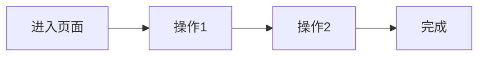

# {系统名称} - 功能操作手册

> 生成时间：{日期}
> 规约版本：v1.0
> 遍历覆盖率：{百分比}%

## 文档说明

本手册基于 Playwright 浏览器代理实际操作过程生成，所有内容均有截图素材支撑。

**核心原则**：所见即所得，无可视化证据不记录

## 目录

- [1. {导航模块1}](#1-导航模块1)
  - [1.1 {一级菜单}](#11-一级菜单)
    - [1.1.1 {二级菜单}](#111-二级菜单)
- [2. {导航模块2}](#2-导航模块2)

---

## 1. {导航模块1}

### 1.1 {一级菜单}

#### 1.1.1 {二级菜单/功能页面}

| 属性 | 值 |
|------|------|
| **节点标识** | {完整节点标识} |
| **素材编号** | {简码}-{起始}-{结束} |
| **遍历状态** | ✅ 已遍历 / ⚠️ 部分不可操作 |
| **关联接口** | API-XXX, API-XXX |

**功能说明**：

{基于截图内容描述功能用途，禁止捏造}

**操作路径**：

1. 点击导航栏「{模块名}」
2. 展开菜单，点击「{一级菜单}」
3. 点击「{二级菜单}」进入页面

**操作前界面**：

**操作后界面**：

**可见操作项**：

| 序号 | 操作名称 | 类型 | 说明 | 状态 | 素材编号 |
|------|----------|------|------|------|----------|
| 1 | {操作名} | 按钮/链接/输入框 | {说明} | ✅/⚠️ | {编号} |
| 2 | {操作名} | 按钮/链接/输入框 | {说明} | ✅/⚠️ | {编号} |

**操作流程**：

**备注**：

{如有不可操作项，说明原因}

---

## 附录

### A. 素材索引

| 素材编号 | 文件名 | 关联节点 | 说明 |
|----------|--------|----------|------|
| {编号} | {文件名}.png | {节点标识} | {说明} |

### B. 未覆盖功能

| 节点标识 | 原因 | 后续计划 |
|----------|------|----------|
| {标识} | {原因} | {计划} |
